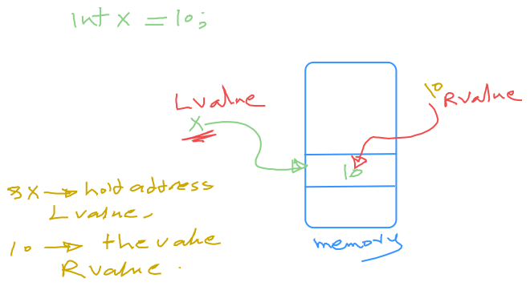
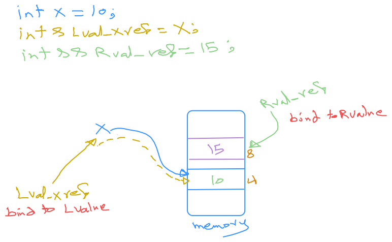

In C++, **lvalues** and **rvalues** are fundamental concepts that describe the nature of expressions and help us understand how variables and objects behave in memory.

## **Lvalues vs Rvalues**

### **Lvalue**:

**lvalue** is a variable or (expressions that can appear on the left-hand side of an assignment operator) that refers to a special location in memory (i.e., it has a memory address).

- **Characteristics**:
    1. Has a memory address (can be located in memory).
    2. It can appear on the left-hand side of an assignment.
    3. It can be used to refer to modifiable objects.
- **Examples**:
    
    ```cpp
    int a = 10; // a is an lvalue, it has an address.
    a = 20;     // a is an lvalue, so we can assign a value to it.
    
    int* ptr = &a; // ptr is an lvalue that holds the address of 'a'.
    
    ```
    
    In this case, `a` is an lvalue because it represents a memory location. It is something that has an address in memory and can be modified.
    

### **Rvalue**:

An **rvalue** is a temporary object or value (often the result of expressions and can usually only appear on the right-hand side of an assignment operator) that does not have a persistent memory address. Rvalues generally represent values that are not meant to be modified, or they represent temporary objects created during expressions.

- **Characteristics**:
    1. Does not have a stable memory address (it is temporary).
    2. Cannot appear on the left-hand side of an assignment (unless moved or bound to an lvalue reference).
    3. Can represent literals, temporary objects, or the result of certain expressions.
- **Examples**:
    
    ```cpp
    int a = 10;  // a is an lvalue.
    int b = a + 5; // (a + 5) is an rvalue, it does not have a memory address.
    
    int* ptr = &a + 5; // (a + 5) is an rvalue expression.
    
    ```
    
    Here, the expression `a + 5` creates a temporary value (which is an rvalue). It doesn’t have an address in memory you can directly reference.
    

### **The distinction:**

- **Lvalues** represent objects that persist in memory.
- **Rvalues** represent temporary values or computations that don’t persist in memory.


A simplified way to determine lvalues and rvalues:

- If you can take the address of an expression, it's an lvalue.
- If an expression's type is an lvalue reference (e.g., `T&` or `const T&`), it's an lvalue.
- Otherwise, it's an rvalue. Conceptually (and often practically), rvalues correspond to temporary objects, such as function return values or objects obtained through implicit type conversions, and most literal values (e.g., `10` and `5.3`) are also rvalues.




## 1. **What is a Reference?**

A **reference** in C++ is an alias, or a way to refer to an existing variable or object. Instead of working with a copy, a reference allows you to work directly with the original variable.

### Syntax for a Reference:

To create a reference to a variable, you use the `&` symbol:

```cpp
int a = 5;
int& ref = a;  // ref is a reference to a

```

- `ref` now refers to `a`. Any modification to `ref` will modify `a` because `ref` is just another name for `a`.
c

### 2. **Lvalue References (`&`)**

An **lvalue reference** refers to an **lvalue** (a persistent object with a memory address). It allows you to work with the original object or variable and can be used to modify it.

- **Lvalue references** are typically used when you want to **modify** an object, or when you want to avoid unnecessary copying (e.g., for large objects).
- **Syntax**:
    
    ```cpp
    int a = 10;
    int& ref = a;  // ref is an lvalue reference to a
    
    ```
    

### Example of Lvalue Reference:

```cpp
#include <iostream>

void increment(int& x) {
    x++;  // Modifies the original variable that was passed
}

int main() {
    int a = 10;
    increment(a);  // a is passed by lvalue reference
    std::cout << a << std::endl;  // Output: 11
    return 0;
}

```

Here:

- `x` in `increment` is an **lvalue reference**. Any change made to `x` will affect `a` directly because both `x` and `a` refer to the same memory location.

### Key Points:

- **Lvalue reference** is created using `&`.
- Lvalue references are used when you want to **modify the original** object, or avoid making copies (especially useful for passing large objects to functions).
- Lvalue references can **not** bind to rvalues (temporary objects or literals).

### 3. **Rvalue References (`&&`)**

An **rvalue reference** refers to an **rvalue** (temporary object or value that doesn't have a persistent memory address). It was introduced in **C++11** and is used to enable **move semantics** and **perfect forwarding**.

- Rvalue references allow you to "take ownership" of temporary objects and avoid unnecessary deep copying.
- They are also used to implement **move constructors** and **move assignment operators**, which allow efficient transfer of resources between objects.

### Syntax:

```cpp
int&& rref = 10;  // rref is an rvalue reference to a temporary value

```

### Example of Rvalue Reference (Move Semantics):

```cpp
#include <iostream>
#include <vector>

class MyClass {
public:
    std::vector<int> data;

    MyClass(std::vector<int>&& vec) : data(std::move(vec)) {  // Move constructor
        std::cout << "Move constructor called\n";
    }

    void print() {
        std::cout << "Data size: " << data.size() << std::endl;
    }
};

int main() {
    std::vector<int> vec = {1, 2, 3, 4, 5};
    MyClass obj(std::move(vec));  // Moves vec into obj

    obj.print();  // Outputs: Data size: 5
    std::cout << "vec size after move: " << vec.size() << std::endl;  // Outputs: 0 (vec is now empty)

    return 0;
}

```

Here:

- `std::move(vec)` casts `vec` to an rvalue reference, which triggers the move constructor of `MyClass`. This avoids copying the contents of `vec` and "moves" the data to `obj`.

### Key Points:

- **Rvalue reference** is created using `&&`.
- Rvalue references are primarily used in **move semantics** to transfer resources without copying.
- Rvalue references can **only** bind to temporary (rvalue) objects.
- You cannot modify the original object after moving its resources, as it’s typically left in a valid but unspecified state.

 

### 4. **Const References (`const &`)**

A **const reference** is a reference to an object that **cannot be modified**. The object itself might be an lvalue or an rvalue, but with a `const` reference, you guarantee that the object cannot be altered through that reference.

### Syntax:

```cpp
int a = 10;
const int& cref = a;  // cref is a const lvalue reference to a

```


```cpp
int&& rref = 20;
const int& cref2 = std::move(rref);  // cref2 is a const rvalue reference

```
### simple implementation of std::move
```cpp
template<typename T>
T&& move(T& arg) {
    return static_cast<T&&>(arg);
}

```

### Example of Const Reference (Binding to Both Lvalues and Rvalues):

```cpp
#include <iostream>

void printValue(const int& x) {  // Takes a const reference, so the object cannot be modified
    std::cout << x << std::endl;
}

int main() {
    int a = 5;
    printValue(a);         // Can bind to lvalue

    printValue(10);        // Can also bind to rvalue (temporary value)

    const int& cref = 20;  // Can bind to rvalue, but cref is constant
    std::cout << cref << std::endl;  // Outputs: 20

    return 0;
}

```

Here:

- The function `printValue` takes a `const int&`, which means it accepts both lvalues and rvalues but **does not modify** them.
- The `const int&` allows binding to both **lvalues** (like `a`) and **rvalues** (like `10` or `20`).

### Key Points:

- **Const reference** is declared using `const &`.
- Const references can bind to **both lvalues and rvalues**, making them very flexible for passing arguments to functions without making copies.
- **Const references** prevent modification of the object they refer to, but they do not prevent read-only access.

### 5. **Perfect Forwarding**

Perfect forwarding is a technique used to forward arguments to another function while maintaining their value category (lvalue or rvalue). This is accomplished using **rvalue references** and `std::forward`.

```cpp
#include <iostream>
#include <utility>

template <typename T>
void forward_example(T&& arg) {
    // Perfect forward the argument
    printValue(std::forward<T>(arg));
}

int main() {
    int x = 10;
    forward_example(x);   // Forward an lvalue
    forward_example(20);  // Forward an rvalue
    return 0;
}

```

In the `forward_example` function:

- `T&& arg` is a **forwarding reference** (also called **universal reference**). It can bind to both lvalues and rvalues.
- `std::forward<T>(arg)` is used to **forward** the argument to another function while preserving whether it was an lvalue or rvalue.

### Summary:

| Reference Type | Syntax | Bind to | Characteristics |
| --- | --- | --- | --- |
| **Lvalue Reference** | `T&` | Lvalues only | Can modify the original object. |
| **Rvalue Reference** | `T&&` | Rvalues only | Enables move semantics, transfer ownership without copying. |
| **Const Reference** | `const T&` | Both Lvalues and Rvalues | Read-only access, can bind to both lvalues and rvalues. |
| **Forwarding Reference** | `T&&` (in template) | Both Lvalues and Rvalues | Forwards arguments while preserving their value category (perfect forwarding). |

### Key Differences:

- **Lvalue references (`&`)** bind to **persistent** objects and allow modification.
- **Rvalue references (`&&`)** bind to **temporary** objects and are used in move semantics.
- **Const references (`const &`)** prevent modification, and can bind to **both lvalues and rvalues**.
- **Forwarding references** (used in template code) allow perfect forwarding, forwarding arguments while keeping their value category (lvalue or rvalue).

Understanding these concepts helps in optimizing C++ code, especially when dealing with performance-critical applications like those involving large data structures or memory management.