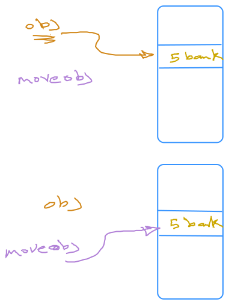
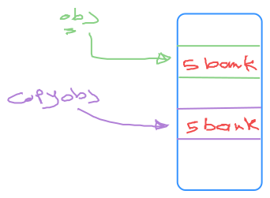

## **Move Semantics VS Copy Semantics**

---

### **Copy Semantics (a Deep Copy)**

**Deep Copying:** When an object is copied using copy semantics, a **completely independent duplicate** is created. This involves duplicating all the data members, including any dynamically allocated memory. The new object has a separate copy of the resources, ensuring that modifications to one object don't affect the other.

Copy semantics deal with duplicating an object. They are used when:

1. Assigning one object to another (copy assignment).
2. Passing or returning an object by value.

Key operations for copy semantics:

- **Copy Constructor**: Creates a new object as a copy of another.
- **Copy Assignment Operator**: Replaces the contents of an object with those of another.

**Performance Implications:** Deep copying can be expensive, especially for objects with large amounts of data or complex structures.

**Use Cases:** Copy semantics is essential when you need to create independent copies of objects to ensure data integrity and isolation.

```cpp
class MyClass {
private:
    int* data; // Dynamic resource

public:
    // Constructor
    MyClass(int value) : data(new int(value)) {}

    // Copy Constructor
    MyClass(const MyClass& other) : data(new int(*other.data)) {
        std::cout << "Copy Constructor called\n";
    }

    // Copy Assignment Operator
    MyClass& operator=(const MyClass& other) {
        if (this == &other) return *this; // Handle self-assignment
        std::cout << "Copy Assignment Operator called\n";

        // Clean up old resource
        delete data;

        // Copy new resource
        data = new int(*other.data);
        return *this;
    }

    // Destructor
    ~MyClass() { delete data; }


int main(){
    MyClass obj(5);
    MyClass moveobj = std::move(obj);
    return 0;
}
/*output:
Move Constructor called
*/
```




---

### **Move Semantics (a shallow copy)**

**Transfer of Ownership:** Move semantics focuses on **transferring ownership** of resources from one object (the source) to another (the destination) without creating a new copy. This is particularly useful when dealing with temporary objects or objects that are about to be destroyed.

Move semantics deal with transferring ownership of resources instead of duplicating them. They are used for optimization, especially when:

1. Returning a local object from a function.
2. Passing an object by value that won't be reused.

Key operations for move semantics:

- **Move Constructor**: Transfers ownership of resources from one object to another.
- **Move Assignment Operator**: Transfers ownership of resources to an existing object.

**Efficiency:** Move operations are generally **much more efficient** than copy operations because they involve a shallow copy of data members and a simple transfer of resource ownership pointers.

**Implementation:** Move semantics relies on **move constructors** and **move assignment operators**, which use **rvalue references** (`T&&`) to identify objects eligible for moving. These operators transfer ownership of the resources from the source to the destination, leaving the source object in a valid but indeterminate state.

**No-throw Guarantee:** Move constructors and assignment operators should be marked `noexcept` to ensure they don't throw exceptions. This is crucial for compatibility with the Standard Library, as containers and algorithms rely on this guarantee to ensure safe and efficient resource management.

```cpp
class MyClass {
private:
    int* data;

public:
    // Constructor
    MyClass(int value) : data(new int(value)) {}

    // Move Constructor
    MyClass(MyClass&& other) noexcept : data(other.data) {
        std::cout << "Move Constructor called\n";
        other.data = nullptr; // Nullify the source's pointer
    }

    // Move Assignment Operator
    MyClass& operator=(MyClass&& other) noexcept {
        if (this == &other) return *this; // Handle self-assignment
        std::cout << "Move Assignment Operator called\n";

        // Clean up old resource
        delete data;

        // Transfer ownership
        data = other.data;
        other.data = nullptr;
        return *this;
    }

    // Destructor
    ~MyClass() { delete data; }

    void print() const {
        if (data)
            std::cout << "Value: " << *data << '\n';
        else
            std::cout << "Value: null\n";
    }
};

int main(){
    MyClass obj(5);
    MyClass Copyobj = obj;
    return 0;
}
/*output:
Copy Constructor called
*/
```


 
---

### **Example: Applying Both in a Class**

Here’s how to apply copy and move semantics together:

```cpp
class MyClass {
private:
    int* data;

public:
    // Constructor
    MyClass(int value) : data(new int(value)) {}

    // Copy Constructor
    MyClass(const MyClass& other) : data(new int(*other.data)) {
        std::cout << "Copy Constructor called\n";
    }

    // Move Constructor
    MyClass(MyClass&& other) noexcept : data(other.data) {
        std::cout << "Move Constructor called\n";
        other.data = nullptr;
    }

    // Copy Assignment Operator
    MyClass& operator=(const MyClass& other) {
        if (this == &other) return *this;
        std::cout << "Copy Assignment Operator called\n";
        delete data;
        data = new int(*other.data);
        return *this;
    }

    // Move Assignment Operator
    MyClass& operator=(MyClass&& other) noexcept {
        if (this == &other) return *this;
        std::cout << "Move Assignment Operator called\n";
        delete data;
        data = other.data;
        other.data = nullptr;
        return *this;
    }

    // Destructor
    ~MyClass() { delete data; }

    void print() const {
        if (data)
            std::cout << "Value: " << *data << '\n';
        else
            std::cout << "Value: null\n";
    }
};

int main() {
    MyClass obj1(10);      // Regular Constructor
    MyClass obj2 = obj1;   // Copy Constructor
    MyClass obj3 = std::move(obj1); // Move Constructor

    obj2 = obj3;           // Copy Assignment Operator
    obj3 = MyClass(20);    // Move Assignment Operator
}

```

---


## Ownership

**Ownership** in programming refers to the responsibility for managing the lifecycle of a resource, such as memory, files, or network connections. When an object owns a resource, it is responsible for allocating, managing, and freeing that resource when it's no longer needed.

In languages like C++, ownership is an important concept because it helps manage memory and other resources efficiently while avoiding issues like memory leaks or dangling pointers.


### Example of Ownership

Here’s an example that demonstrates ownership in C++ using a simple class:

```cpp
#include <iostream>

class Resource {
private:
    int* data;

public:
    // Constructor - takes ownership of the resource
    Resource(int value) {
        data = new int(value);
        std::cout << "Resource allocated with value: " << *data << '\n';
    }

    // Destructor - releases the resource
    ~Resource() {
        delete data;
        std::cout << "Resource deallocated\n";
    }

    // Getter
    int getValue() const {
        return *data;
    }
};

int main() {
    Resource res1(42); // res1 owns the resource

    // res1 manages its resource and will free it when out of scope
    std::cout << "Value in resource: " << res1.getValue() << '\n';

    // Ownership automatically ends when the object goes out of scope
    return 0;
}
```
### Transfer the ownership
**Transfer of ownership in C++ signifies the transfer of responsibility for managing the memory associated with an object from one entity (like a function or object) to another**.  This is a crucial concept in modern C++, particularly when dealing with resource management and preventing memory leaks or dangling pointers.

Here’s how ownership transfer works in C++:

*   **Smart Pointers:** Modern C++ relies heavily on smart pointers for ownership transfer. The `std::unique_ptr` and `std::shared_ptr` are the primary tools for this.

    *   **`std::unique_ptr`:**
        *   Represents **exclusive ownership** of a resource.
        *   Ownership can be **transferred using move semantics**, as discussed in Chapter 9 of the sources.
        *   **Cannot be copied**, ensuring only one `unique_ptr` manages the resource at a time.
        *   Example: Transferring ownership of a `unique_ptr` to a function:
            ```c++
            void processData(std::unique_ptr<Data> data) { 
               // ... process the data, now owning it ... 
            }

            int main() {
               auto data = std::make_unique<Data>(); 
               processData(std::move(data)); // Ownership transferred to processData
               // ... data is no longer owned here ...
            }
            ```

    *   **`std::shared_ptr`:**
        *   Allows **shared ownership** of a resource using reference counting.
        *   **Multiple `shared_ptr`s can point to the same object**, and the object is automatically deleted when the last `shared_ptr` goes out of scope.
        *   Ownership is **shared by simply passing `shared_ptr` by value**.
        *   Example:
            ```c++
            void useData(std::shared_ptr<Data> data) { 
               // ... use the data, sharing ownership ... 
            }

            int main() {
               auto data = std::make_shared<Data>(); 
               useData(data);  // Ownership shared with useData
               // ... data is still owned here ...
            }
            ```

*   **Functions and Ownership:**

    *   When a function takes a **raw pointer as a parameter, it's generally assumed to not be taking ownership** of the pointed-to object.
    *   If a function **needs to take ownership**, it should accept a `unique_ptr` or `shared_ptr`, clearly indicating the transfer.

*   **Return Values:**

    *   Returning a raw pointer from a function can be ambiguous regarding ownership.
    *   Returning a `unique_ptr` or `shared_ptr` explicitly communicates ownership transfer to the caller.

**Best Practices for Ownership Transfer:**

*   **Use smart pointers (`unique_ptr` or `shared_ptr`) for managing ownership.**
*   **Use `make_unique` and `make_shared` for creating smart pointers.**
*   **Avoid raw pointers for ownership transfer.**
*   **Clearly document ownership semantics in function parameters and return types.**

**By adhering to clear ownership transfer practices, C++ code becomes more robust, easier to maintain, and less prone to memory-related errors.**


--- 
## Resource Acquisition Is Initialization(RAII)

Resource Acquisition Is Initialization (RAII) is a crucial programming technique in C++ that **ties the lifespan of a resource to the lifespan of an object**. This means when an object is created, it acquires the necessary resources, and when the object is destroyed, those resources are automatically released. This ensures resources are properly managed, preventing leaks and issues like dangling pointers.

Here's how RAII works in practice:

*   **Resource Acquisition in Constructor:** When an RAII object is constructed, its constructor acquires the necessary resources. These resources could include memory, file handles, network connections, mutexes, or any other entity that needs explicit acquisition and release.
*   **Resource Release in Destructor:** When the RAII object goes out of scope or is explicitly deleted, its destructor is automatically called. The destructor's primary responsibility is to release the acquired resources.
*   **Exception Safety:** One of the key benefits of RAII is exception safety. Even if an exception occurs during the object's lifetime, the destructor is still guaranteed to be called, ensuring resources are cleaned up properly. 

**Benefits of RAII:**

*   **Automatic Resource Management:** Eliminates the need for manual resource cleanup, reducing code complexity and the likelihood of errors.
*   **Exception Safety:** Guarantees resource release even in the presence of exceptions.
*   **Code Clarity:** Makes resource ownership and management explicit and localized.
*   **Simplified Code Logic:** By automating resource handling, code logic becomes cleaner and focuses on the core functionality rather than resource management details.

**Examples of RAII in C++:**

*   **Smart Pointers:** `std::unique_ptr` and `std::shared_ptr` are prime examples of RAII. They manage the memory associated with dynamically allocated objects, ensuring deallocation when they go out of scope.
*   **Containers:** Standard Library containers like `std::vector` and `std::string` employ RAII to manage the memory they use internally.
*   **File Streams:** Objects like `std::ofstream` and `std::ifstream` acquire file handles on construction and release them in their destructors, ensuring proper file closure.
*   **Mutexes:** `std::mutex` and other synchronization primitives acquire and release locks in their constructors and destructors, simplifying thread synchronization and preventing deadlocks.

RAII is deeply ingrained in the design of modern C++, and it's considered a fundamental principle for writing safe, robust, and efficient code. By leveraging RAII, developers can significantly reduce the cognitive load associated with resource management, allowing them to focus on the essential logic of their programs.

----
### NRVO (Named Return Value Optimization) and RVO (Return Value Optimization) 
**NRVO (Named Return Value Optimization) and RVO (Return Value Optimization) are compiler optimizations that prevent unnecessary copying of objects when they are returned from functions.** They achieve this by constructing the returned object directly in the memory location where it will be used, rather than creating a temporary copy and then copying or moving it.

* **Since C++17, mandatory elision of copy/move operations ensures that objects returned by value as nameless temporaries (`return object;`) incur no performance penalty.** This is known as mandatory elision.

* **For local variables that are not function parameters, the compiler is permitted to perform non-mandatory elision of copy/move operations, known as NRVO (Named Return Value Optimization).** This optimization is not guaranteed by the standard.

* **Compilers cannot apply mandatory nor non-mandatory elision when using `std::move()` to return an object (`return std::move(object);`).** As a result, the compiler falls back to move semantics if the object supports it or copy semantics if it does not.

* **Using `std::move()` to return an object has a small performance impact compared to NRVO when the compiler falls back to move semantics, but it can have a significant performance impact when it falls back to copy semantics.**

**Therefore, it's recommended to use `return object;` when returning a local variable or nameless temporary from a function and avoid using `std::move()`.**

For NRVO, even though the copy/move constructors won't be called, they still need to be accessible; otherwise, the program will be ill-formed.

(N)RVO works only for local variables or function parameters. Returning data members of an object never triggers (N)RVO.
