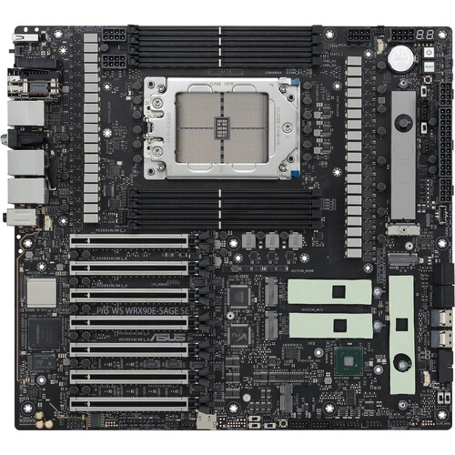
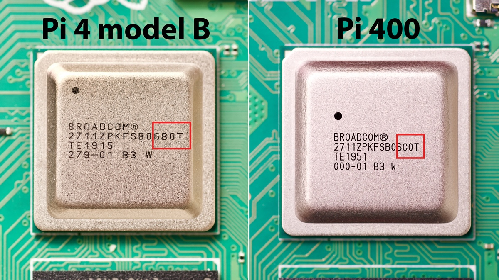

# How can I write a Platform Driver?

# **What are Platform Bus**, **Platform Device**, and **Platform Driver**

# PC Motherboard, upgradable development board vs SoC (system on chip),

Of course! Let's put on our expert hats. This is an excellent topic for a lecture, as it bridges the fundamental concepts of the Linux kernel with practical embedded systems development. I'll structure this explanation as if we were in a classroom.

### **Setting the Stage: The PC vs. The SoC Universe**

To understand "Platform Devices," we must first understand the environment they live in: the **System-on-Chip (SoC)**.

Imagine a classic PC motherboard:



- You have a **CPU** socket.
- You have **RAM** slots.
- You have various **bus controllers** (PCI, USB, SATA) on the chipset.
- You **plug in** your devices: a graphics card into a PCIe slot, a network card into another, a sound card, etc.

The key here is **discoverability**. When the system boots, the BIOS/UEFI and the OS can **probe the PCI bus** and ask every device, "Who are you?" The device responds with a **Vendor ID, Device ID, and memory requirements**. The OS then assigns resources (memory addresses, IRQs) and loads the appropriate driver. This is **Dynamic Device Discovery**.

---

Now, let's shrink that entire PC motherboard onto a single chip: the **SoC** (like the Broadcom BCM2711 in your Raspberry Pi 4B).



- The **CPU cores** (Cortex-A72) are there.
- The **GPU** is there.
- The **memory controller** is there.
- Peripherals like **I2C controllers**, **SPI controllers**, **PWM controllers**, **GPIO controllers**, and **UARTs** are all **hardwired** onto the same silicon.

**Here is the critical difference:** These on-SoC peripherals are **not discoverable**. There is no bus like PCI to probe them. The OS cannot ask the UART block "Who are you?" because it's not on a bus designed for that.

**How does the OS know they exist?**
It must be **told** in advance. This information is **statically provided** to the kernel.

- **In the old days (Board Support Packages - BSPs):** This information was hard-coded in C files as `platform_device` structures within the kernel source tree. Changing a pin would require recompiling the kernel!
- **The modern way (Device Tree):** The information is written in a human-readable text file, the **Device Tree Blob (`.dts`)**. This file is compiled (`.dtb`) and passed by the bootloader (like the Raspberry Pi's `start.elf`) to the kernel. The kernel then parses this "hardware blueprint" to learn about all the non-discoverable devices.

---

### **Comparison: PCI Device vs. Platform Device**

Let's make a direct comparison.

| Feature | PCI Device (Classic PC) | Platform Device (Embedded SoC) |
| --- | --- | --- |
| **Discovery** | **Hardware Discoverable** via PCI Configuration Space. | **Non-Discoverable**. Statically defined. |
| **How Kernel Finds It** | Kernel probes PCI bus; devices identify themselves. | Kernel is told via **Device Tree** (or old C-code). |
| **Resource Assignment** | Dynamic. BIOS/OS assigns I/O addresses, Memory Regions, and IRQs. | Static/Fixed. Defined in the Device Tree. The hardware design is fixed. |
| **Example Devices** | Graphics Cards, Network Cards, HBA Cards. | SoC-internal: I2C, SPI, UART, PWM, Watchdog Timers. |
| **Driver Matching** | Matches on **Vendor ID & Device ID**. | Matches on **Device Tree "compatible" string** OR a simple name. |
| **Memory Access** | Uses `pci_iomap()` to get kernel-virtual addresses for PCI BARs. | Uses `platform_get_resource()` and `devm_ioremap_resource()` for memory-mapped IO. |
| **Interrupts (IRQs)** | `pci_irq_vector()` or similar to get the assigned IRQ number. | `platform_get_irq()` to get the IRQ number defined in the Device Tree. |
| **Analogy** | **Plug-and-Play**. Like finding a USB drive and auto-installing a driver. | **Blueprint-Driven**. Like building a house from an architect's plan; you know where every window and door is before you start. |

---

### **Deep Dive: The "Platform" Abstraction**

The Linux kernel provides the **Platform Driver/Device** model specifically to handle these non-discoverable, often memory-mapped, devices that are "part of the platform."

It consists of two main parts:

1. **`platform_device`**: Represents the **hardware**. It holds the static information about the device: its name, the memory regions (resources) it uses, its IRQ numbers, etc. In the modern Device Tree world, this structure is automatically created by the kernel when it parses a matching node in the Device Tree.
2. **`platform_driver`**: Represents the **software** that controls the hardware. This is the driver you write. It contains the probe/remove functions and a way to identify which `platform_device` it should manage.

### **Summary for Your Lecture**

- **Platform Devices** are for **non-discoverable** hardware, which is the norm in the embedded SoC world (RPi, etc.).
- They are the **antithesis of PCI/USB** devices.
- The **Device Tree** is the **modern, standard way** to describe these devices to the kernel, replacing the old, messy board files.
- The **Platform Driver Model** provides a consistent framework for writing drivers for these devices, centered around the `probe()`/`remove()` functions and resource retrieval APIs (`platform_get_resource`, `platform_get_irq`).
- The core of driver binding is the **matching of the `compatible` string** in the Device Tree with the string in the driver's `of_match_table`.

# **Platform Bus**, **Platform Device**, and **Platform Driver**

## 🔧1. What is the **Platform Bus**?

The **Platform Bus** is a **virtual bus** in the Linux device model. It doesn’t correspond to any physical bus (like PCI or USB) — instead, it's used to model **on-chip (SoC) devices** that are **not discoverable** by hardware (e.g., through enumeration). These devices are usually **known ahead of time**, often described in:

- Device Tree —>used mostly on ARM/embedded systems
- ACPI(Advanced Configuration and Power Interface) —>used mostly on x86/PC-class systems
- Statistically registered in board files (for older systems)—>used in older kernels before Device Tree adoption

So the platform bus is a **framework** that connects **platform devices** with **platform drivers**.

---

## 📦 2. What is a **Platform Device**?

A **Platform Device** represents a device that resides on the platform bus. It is usually:

- Memory-mapped I/O (MMIO)
- Integrated into the SoC
- Not discoverable dynamically (unlike PCI/USB)

It is represented in code by the `struct platform_device`.

### 🧱 Example: Define a platform device in code

This is legacy style (older kernels with board files):

```c
static struct resource my_dev_resources[] = {
    {
        .start = 0x10000000,
        .end   = 0x10000FFF,
        .flags = IORESOURCE_MEM,
    },
};

static struct platform_device my_platform_device = {
    .name = "my_driver",  // must match driver name
    .id = -1,
    .num_resources = ARRAY_SIZE(my_dev_resources),
    .resource = my_dev_resources,
};

platform_device_register(&my_platform_device);

```

In modern kernels, devices are usually described via **Device Tree** instead.

---

## 🧑‍💻3. What is a **Platform Driver**?

A **Platform Driver** is a Linux kernel driver that **binds** to platform devices.

It is represented in code by `struct platform_driver`.

### 🧱 Example: Define a platform driver

```c
static int my_probe(struct platform_device *pdev)
{
    // initialize hardware, map resources, etc.
    printk(KERN_INFO "my_driver: device probed!\n");
    return 0;
}

static int my_remove(struct platform_device *pdev)
{
    // cleanup
    printk(KERN_INFO "my_driver: device removed!\n");
    return 0;
}

static struct platform_driver my_driver = {
    .driver = {
        .name = "my_driver", // must match device name
        .owner = THIS_MODULE,
    },
    .probe = my_probe,
    .remove = my_remove,
};

module_platform_driver(my_driver);

```

---

## 🧩 Matching Process: How Device & Driver Bind

- The `platform_driver` and `platform_device` are matched via the `name` field.
- In Device Tree systems, the driver matches the **compatible** string via `of_match_table`.

### DT Matching Example:

**Device Tree:**

```
my_device@10000000 {
    compatible = "myvendor,mydevice";
    reg = <0x10000000 0x1000>;
};

```

**Driver:**

```c
static const struct of_device_id my_of_match[] = {
    { .compatible = "myvendor,mydevice" },
    { },
};
MODULE_DEVICE_TABLE(of, my_of_match);

static struct platform_driver my_driver = {
    .driver = {
        .name = "my_driver",
        .of_match_table = my_of_match,
    },
    .probe = my_probe,
    .remove = my_remove,
};

```

---

## 🔄 Summary Table

| Concept | Description |
| --- | --- |
| Platform Bus | Virtual bus for non-discoverable SoC devices |
| Platform Device | Represents a device on the platform bus (from DT or static) |
| Platform Driver | Binds to platform device and drives the hardware |

| Method | Platform | Description Style | Dynamic? | Modern Usage |
| --- | --- | --- | --- | --- |
| **Device Tree** | ARM, RISC-V | External `.dts` files | Semi-static | ✅ Widely used |
| **ACPI** | x86, x86_64 | Firmware (BIOS/UEFI) tables | Dynamic | ✅ On PCs |
| **Board files** | Old ARM | C code in kernel source | Static | ❌ Deprecated |

# `struct platform_device` & `platform_device_register`

---

## 1. `struct platform_device`

A **platform device** represents a hardware block that is **not discoverable** (unlike PCI/USB). Instead, the board or SoC description (Device Tree, ACPI, or board file in old kernels) explicitly registers it.

`struct platform_device` just *wraps* it with extra info specific to platform devices (like resources, names, etc.).

Definition (simplified from `<linux/platform_device.h>`):

```c
struct platform_device {
    const char              *name;
    int                      id;
    struct device            dev;
    u32                      num_resources;
    struct resource         *resource;
};

```

### Important fields:

- **`name`** → Matches the driver’s `struct platform_driver.driver.name` (or `of_match_table` if using DT).
- **`id`** → For multiple instances (like `"uart"` id `0`, `1`, `2`).

| `id` value | Meaning | Example sysfs name |
| --- | --- | --- |
| `0, 1, 2, ...` | Multiple instances of same device | `my_driver.0`, `my_driver.1` |
| `-1` | Only one instance (no numeric suffix) | `my_driver` |

```c
static struct platform_device my_device0 = {
    .name = "my_driver",
    .id   = 0,
};

static struct platform_device my_device1 = {
    .name = "my_driver",
    .id   = 1,
};
→ Devices will appear as:

/sys/devices/platform/my_driver.0
/sys/devices/platform/my_driver.1
```

- **`dev`** → Embedded `struct device` (used by driver core),
    - is member is **a generic device structure** — it’s what connects your platform device into the **Linux device model** (the “device/driver core”).
    - `struct device` is the **core object** representing *any* hardware device in the Linux kernel — USB, PCI, platform, etc.
    

| Purpose | Example |
| --- | --- |
| **Device hierarchy / sysfs** | When you register the platform device, `.dev` helps create entries in `/sys/devices/` and `/sys/class/` |
| **Parent device linkage** | You can set `pdev->dev.parent` to indicate which device this belongs to (e.g., an I²C controller or SoC node) |
| **Device data storage** | You can attach private data with: `dev_set_drvdata(&pdev->dev, my_data);` and retrieve it later in the driver using `dev_get_drvdata(&pdev->dev);` |
| **Power management** | `pdev->dev` contains fields used by runtime PM (`pm_runtime_get_sync()`, `pm_runtime_put()`, etc.) |
| **DMA and resource management** | DMA configuration, coherent memory allocation, etc., use `&pdev->dev` as the handle |
| **Logging / debugging** | The `dev_info()`, `dev_err()`, `dev_dbg()` macros all take `&pdev->dev` as their first argument, giving messages tagged with the correct device name |
| **Device Tree or ACPI binding** | If the platform device was created from DT or ACPI, those references are stored in `pdev->dev.of_node` or `.acpi_node` |
- **`resource`** → Describes memory regions, IRQs, DMA channels, etc. (`struct resource` array).
- **`num_resources`** → How many resources.

a **resource** means any hardware region or signal the device needs to function —

things like:

- I/O memory regions (registers)
- IRQ (interrupt line)
- DMA channels
- I/O ports (on x86)

Linux represents each one as a **`struct resource`** (defined in `include/linux/ioport.h`).

---

### 🧱 Structure of `struct resource`

```c
struct resource {
    resource_size_t start;
    resource_size_t end;
    const char *name;
    unsigned long flags;
};

```

The `flags` field describes the type — examples:

| Flag | Meaning |
| --- | --- |
| `IORESOURCE_MEM` | Memory-mapped I/O region |
| `IORESOURCE_IRQ` | Interrupt line |
| `IORESOURCE_IO` | I/O port region |

---

### 🧰 How they’re used in a platform device

### Example: one memory region and one IRQ

```c
static struct resource my_device_resources[] = {
    [0] = {
        .start = 0x10000000,
        .end   = 0x10000fff,
        .flags = IORESOURCE_MEM,
    },
    [1] = {
        .start = 32,
        .end   = 32,
        .flags = IORESOURCE_IRQ,
    },
};

static struct platform_device my_device = {
    .name = "my_driver",
    .id   = -1,
    .num_resources = ARRAY_SIZE(my_device_resources),
    .resource      = my_device_resources,
};

```

So:

- `.resource` points to the array describing hardware regions
- `.num_resources` tells the kernel how many entries are in that array

When you call:

```c
platform_device_register(&my_device);

```

→ The kernel records these resources and makes them available to the **platform driver** that matches `"my_driver"`.

---

### ⚙️ In the driver side (accessing resources)

In your **platform driver’s `probe()`** function, you use helpers like:

```c
struct resource *res;
void __iomem *base;

res = platform_get_resource(pdev, IORESOURCE_MEM, 0);
base = devm_ioremap_resource(&pdev->dev, res);

int irq = platform_get_irq(pdev, 0);

```

Explanation:

- `platform_get_resource()` looks up a resource from that array by type and index.
- `devm_ioremap_resource()` maps the memory region into kernel virtual address space.
- `platform_get_irq()` is a shortcut to get the IRQ number from an `IORESOURCE_IRQ` entry.

---

| Member | Type | Purpose | Example |
| --- | --- | --- | --- |
| `.resource` | `struct resource *` | Points to array of hardware resources | memory + irq array |
| `.num_resources` | `u32` | Number of entries in `.resource` array | `ARRAY_SIZE(my_device_resources)` |

And each **`struct resource`** describes one hardware region or signal (MEM, IRQ, etc.).

---

### ✅ In short:

> .resource and .num_resources together describe what hardware resources the platform device uses,
> 
> 
> and they let the **platform driver** know *where* and *how* to access the device’s registers and interrupts.
> 

---

Would you like me to show a **matching platform driver** example that uses those resources (i.e. does `ioremap`, gets IRQ, etc.) to complete the picture?

So, this struct **represents the hardware device** and its system resources.

---

## `platform_device_register`

This function **adds a platform_device to the kernel’s platform bus**.

```c
int platform_device_register(struct platform_device *pdev);

```

What happens:

1. Initializes the `struct device` inside `pdev`.
2. Adds it to the device model (sysfs).
3. Attempts to match it with a registered **platform_driver**:
    - If match found → driver’s `probe()` is called.

There’s also a helper:

```c
struct platform_device *platform_device_register_simple(
        const char *name, int id,
        struct resource *res, unsigned int num);

```

Useful when you don’t want to fill everything manually.

---

### Example: Manually registering a platform device

This is mostly used in **board files** (before Device Tree became standard).

```c
#include <linux/module.h>
#include <linux/platform_device.h>

static struct resource my_resources[] = {
    {
        .start  = 0x48060000,         // Example MMIO base
        .end    = 0x48060fff,         // Size (4KB)
        .flags  = IORESOURCE_MEM,
    },
    {
        .start  = 45,                 // Example IRQ line
        .end    = 45,
        .flags  = IORESOURCE_IRQ,
    },
};

static struct platform_device my_device = {
    .name           = "my_driver",   // must match platform_driver.driver.name
    .id             = -1,            // -1 = only one instance
    .num_resources  = ARRAY_SIZE(my_resources),
    .resource       = my_resources,
};

static int __init my_device_init(void)
{
    return platform_device_register(&my_device);
}

static void __exit my_device_exit(void)
{
    platform_device_unregister(&my_device);
}

module_init(my_device_init);
module_exit(my_device_exit);

MODULE_LICENSE("GPL");

```

---

# `struct platform_driver` & `platform_driver_register`

## 2.`struct platform_driver`

In Linux, many on-chip devices (like UARTs, I²C controllers, GPIO controllers, etc.) are **platform devices**. They don’t sit on discoverable buses like PCI/USB — instead, they’re described by the board (via **Device Tree** or ACPI).

For such devices, Linux provides a **platform driver model**. The core piece is:

```c
struct platform_driver {
    int (*probe)(struct platform_device *);
    int (*remove)(struct platform_device *);
    void (*shutdown)(struct platform_device *);
    int (*suspend)(struct platform_device *, pm_message_t state);
    int (*resume)(struct platform_device *);

    struct device_driver driver;   // Generic driver structure
};

```

- **`probe`** → Called when a matching `platform_device` is registered (e.g., from Device Tree).
- **`remove`** → Called when the device is unregistered.
- **`shutdown`** → Called during system shutdown.
- **`suspend`/`resume`** → For power management.
- **`driver`** → Embeds a generic `struct device_driver`,
    - A **device driver** is kernel code that knows *how* to control a specific piece of hardware.
    
    It is responsible for:
    
    - Initializing the device
    - Managing its I/O registers and interrupts
    - Providing an interface to user space (via sysfs, character device, network stack, etc.)
    
    The Linux kernel has a **device model** that automatically **matches devices with drivers** — based on name or `compatible` string.
    which includes:
    
    - Name
    - Owner (module reference)
    - Of_match_table (for Device Tree matching)

When you write a platform driver, you fill in this struct.

### ✅ In short

> The **platform device** describes what the hardware is.
> 
> 
> The **platform driver** describes *how* to use it.
> 
> When both are registered and names match, the kernel links them and runs the driver’s `probe()` function.
> 

---

## `platform_driver_register`

This is the macro/function that **registers your driver with the kernel’s platform bus**.

Definition (from `<linux/platform_device.h>`):

```c
int platform_driver_register(struct platform_driver *drv);

```

What it does:

- Registers the `struct platform_driver` with the **platform bus**.
- Tells the kernel:
    
    *“Here’s a driver; whenever you find a matching `platform_device`, call my `probe()`.”*
    

If you use modules, you usually wrap it in a helper macro:

```c
module_platform_driver(my_driver);

```

This expands to:

```c
static int __init my_driver_init(void)
{
    return platform_driver_register(&my_driver);
}
module_init(my_driver_init);

static void __exit my_driver_exit(void)
{
    platform_driver_unregister(&my_driver);
}
module_exit(my_driver_exit);

```

---

## Example: Simple platform driver

```c
#include <linux/module.h>
#include <linux/platform_device.h>
#include <linux/of.h>

static int my_probe(struct platform_device *pdev)
{
    pr_info("my_driver: probed device %s\n", dev_name(&pdev->dev));
    return 0;
}

static int my_remove(struct platform_device *pdev)
{
    pr_info("my_driver: removed device %s\n", dev_name(&pdev->dev));
    return 0;
}

static const struct of_device_id my_of_match[] = {
    { .compatible = "myvendor,mydevice" },
    { }
};
/*
This macro:
Adds metadata to the kernel module's ELF file (under .modinfo)
So tools like udev or modprobe can automatically load the module when a matching device is found.
*/
MODULE_DEVICE_TABLE(of, my_of_match);

static struct platform_driver my_driver = {
    .probe  = my_probe,
    .remove = my_remove,
    .driver = {
        .name           = "my_driver",
        .of_match_table = my_of_match,
        .owner          = THIS_MODULE,
    },
};

module_platform_driver(my_driver);

/*
module_platform_driver(my_driver) equal to :

static int __init my_driver_init(void)
{
    return platform_driver_register(&my_driver);
}
module_init(my_driver_init);

static void __exit my_driver_exit(void)
{
    platform_driver_unregister(&my_driver);
}
module_exit(my_driver_exit);
*/

MODULE_LICENSE("GPL");
MODULE_AUTHOR("Ragab");
MODULE_DESCRIPTION("Example Platform Driver");

```

---

### 🧩 What `MODULE_DEVICE_TABLE(of, …)` does

This macro **exports** your driver’s **Device Tree compatibility table** (`of_match_table`) to **user space**, so that **udev** (or the kernel module autoloader) can automatically **load the right module** when a matching device is found in the Device Tree.

It essentially tells the kernel:

> “If a Device Tree node has a compatible = "..." string that matches one of the entries in my driver’s table, then this driver supports that device.”
> 

| Macro | Purpose |
| --- | --- |
| `MODULE_DEVICE_TABLE(of, my_driver_of_match);` | Exports the list of supported `compatible` strings for automatic module loading based on Device Tree |

✅ **Flow at runtime:**

1. Kernel boots, parses the Device Tree, and finds `"myvendor,mydevice"`.
2. Kernel registers a `platform_device`.
3. When the module loads:
    - `platform_driver_register()` registers `my_driver`.
    - Bus core matches `my_driver` against `mydevice`.
    - If compatible → calls `my_probe()`.
4. When unloading:
    - `platform_driver_unregister()` is called automatically → triggers `my_remove()`.

---

# How it fits together

✅ At boot/module load:

1. `platform_device_register(&my_device)` → creates `/sys/devices/platform/my_driver`.
2. If a `platform_driver` with `.driver.name = "my_driver"` is registered, its `probe()` gets called.
3. The driver can now use `platform_get_resource(pdev, IORESOURCE_MEM, 0)` to access resources.

---

# Modern practice

- **Old kernels** (pre-Device Tree): Board files in `arch/arm/mach-*` registered `platform_device`s manually with `platform_device_register()`.
- **Modern kernels**: Devices are declared in the **Device Tree** (`.dts`) or **ACPI tables**. 
Then the kernel automatically creates `platform_device`s from that. So developers mostly just write **platform drivers**, not devices.

---

⚡ Would you like me to also give you a **side-by-side diagram** showing the flow:

**User-space → Device Tree / Board file → platform_device → platform_driver → probe()**

## 🔁 `dev_set_drvdata()` / `dev_get_drvdata()`

These allow associating driver-specific data with a device instance.

```c
void dev_set_drvdata(struct device *dev, void *data);
void *dev_get_drvdata(const struct device *dev);

```

### Use case:

- Store per-device context (`struct your_device_data`) in the probe function.
- Retrieve it in IRQ handler, remove(), etc.

✅ Safer than using static/global variables.

---

## 🧵 `platform_set_drvdata()` / `platform_get_drvdata()`

These are just wrappers around the `dev_set_drvdata()`/`dev_get_drvdata()` calls, but specific to `platform_device`.

```c
void platform_set_drvdata(struct platform_device *pdev, void *data);
void *platform_get_drvdata(const struct platform_device *pdev);

```

➡️ They internally call `dev_set_drvdata(&pdev->dev, data);`

Use in `platform_driver` probe/remove to store and retrieve driver context.

---

# The Device Tree:

The Device Tree is a data structure used in Linux to describe hardware components, including GPIO pins, on devices like the Raspberry Pi 4B.

 It allows the kernel to configure hardware without hardcoding details. 
For the Raspberry Pi 4B, the Device Tree is typically defined in a `.dts` (Device Tree Source) file, which is compiled into a `.dtb` (Device Tree Blob) file for the kernel to use.

The Raspberry Pi 4B uses the Broadcom BCM2711 SoC, and its GPIO pins are managed by the `pinctrl-bcm2711` driver. GPIO17 corresponds to physical pin 11 on the 40-pin header and is part of the GPIO controller. To configure GPIO17 as an output pin, you can define a custom Device Tree overlay to set its function and initial state.

### Example Device Tree  for GPIO17 as Output

### Steps to Write a Device Tree Node for GPIO17 as Output

1. **Understand the GPIO Controller**: The Raspberry Pi 4B's GPIO controller is described in the Device Tree under the `gpio` node (usually `gpio@7e200000` in the BCM2711). You’ll create an overlay to configure GPIO17.
2. **Create a Device Tree Overlay**: An overlay is a partial Device Tree that modifies or extends the base Device Tree. You’ll define a node to set GPIO17 as an output.
3. **Example Overlay**: Below is an example Device Tree overlay (`.dts`) to configure GPIO17 as an output pin with an initial state (e.g., high or low).

### Example Device Tree Overlay for GPIO17 as Output

```
/dts-v1/;
/plugin/;

/ {
    compatible = "brcm,bcm2711";

    fragment@0 {
        target = <&gpio>;
        __overlay__ {
            /*this tel the pin controller driver to configure pin to be output*/
            gpio17_pins: gpio17_pins {
                brcm,pins = <17>;
                brcm,function = <1>;  /* Output */
                brcm,pull = <0>;      /* No pull-up/down */
            };
            gpio14_pins: gpio14_pins {
                brcm,pins = <14>;
                brcm,function = <1>;  /* Output */
                brcm,pull = <0>;      /* No pull-up/down */
            };
        };
    };

    fragment@1 {
        target-path = "/soc";
        __overlay__ {
            custom_gpio: custom_gpio{
                compatible = "rpi,led-gpio17";
                // led-gpios = <&gpio 17 0>;  /* GPIO17, active-high  this tell the platform driver the pin number */
                led-gpios = <&gpio 14 0>;
                status = "okay";
                pinctrl-names = "default";
                // pinctrl-0 = <&gpio17_pins>;
                pinctrl-0 = <&gpio14_pins>;
            };
        };
    };
};
```

### Explanation of the Overlay

- **/dts-v1/ and /plugin/**: Indicates this is a Device Tree overlay.
- **compatible**: Specifies compatibility with the BCM2711 SoC (Raspberry Pi 4B).
- **fragment@0**: A fragment that modifies the Device Tree.
- **target = <&gpio>**: Targets the GPIO controller node (usually `gpio@7e200000` in the base Device Tree).
- **my_gpio_pin**: A custom node name for your GPIO configuration.
    - **brcm,pins = <17>**: Specifies GPIO17.
    - **brcm,function = <1>**: Sets the pin to output mode (1 = output, 0 = input, per Broadcom pinmux).
    - **brcm,pull = <0>**: Disables pull-up/pull-down resistors (0 = none, 1 = pull-down, 2 = pull-up).
- **&gpio**: References the GPIO controller and applies the pin configuration via `pinctrl`.

### Compiling the Overlay

1. **Save the Overlay**: Save the code above as `gpio17-output-overlay.dts`.
2. **Compile the Overlay**:
Use the Device Tree Compiler (`dtc`) to compile the `.dts` file into a `.dtbo` file:
    
    ```bash
    dtc -@ -I dts -O dtb -o gpio17-output-overlay.dtbo gpio17-output-overlay.dts
    
    ```
    
    - `@`: Enables symbol generation for overlays.
    - `I dts`: Input format is Device Tree Source.
    - `O dtb`: Output format is Device Tree Blob (overlay).
3. **Copy the Overlay**:
Copy the compiled `.dtbo` file to the Raspberry Pi’s `/boot/overlays/` directory:
    
    ```bash
    sudo cp gpio17-output-overlay.dtbo /boot/overlays/
    
    ```
    
4. **Enable the Overlay**:
Edit `/boot/config.txt` to load the overlay at boot:
    
    ```bash
    sudo nano /boot/config.txt
    
    ```
    
    Add the following line:
    
    ```
    dtoverlay=gpio17-output
    
    ```
    
    Save and exit.
    
5. **Reboot**:
Reboot the Raspberry Pi to apply the overlay:
    
    ```bash
    sudo reboot
    
    ```
    

### Verifying the Configuration

- **Check GPIO State**:
Use the `raspi-gpio` tool to verify GPIO17 is set as an output:
    
    ```bash
    raspi-gpio get 17
    
    ```
    
    Expected output (if set to output-high):
    
    ```
    GPIO 17: level=1 fsel=1 func=OUTPUT
    
    ```
    
- **Sysfs (Optional)**:
If you want to manually toggle the pin later, you can use the sysfs interface:
    
    ```bash
    echo 17 > /sys/class/gpio/export
    echo out > /sys/class/gpio/gpio17/direction
    echo 1 > /sys/class/gpio/gpio17/value  # Set high
    echo 0 > /sys/class/gpio/gpio17/value  # Set low
    
    ```
    

### Notes

- **Base Device Tree**: The Raspberry Pi 4B’s base Device Tree is typically found in `/boot/bcm2711-rpi-4-b.dtb`. Overlays modify this at boot.
- **GPIO Numbering**: GPIO17 refers to the BCM numbering scheme. Ensure you’re using BCM numbers, not physical pin numbers.
- **Kernel Support**: Ensure your Raspberry Pi OS is up-to-date, as the kernel must support Device Tree overlays (Linux 4.4+).
- **Alternative Tools**: Instead of sysfs, you can use libraries like `libgpiod` or Python’s `RPi.GPIO` for user-space control after the Device Tree sets the initial configuration.
- **Custom Node Name**: `my_gpio_pin` is arbitrary; choose a meaningful name for your project.

## 📦 `struct of_device_id`

`struct of_device_id` at platform_driver struct  → struct [**device_driver**](https://elixir.bootlin.com/linux/v3.19.8/C/ident/device_driver) driver→   struct of_device_id *[**of_match_table**](https://elixir.bootlin.com/linux/v3.19.8/C/ident/of_match_table);

Used to match a platform driver to a device declared in the **Device Tree** (`.dts`).

```c
struct of_device_id {
    char name[32];
    char type[32];
    char compatible[128];
    const void *data;
};

```

### Example:

```c
static const struct of_device_id my_driver_of_match[] = {
    { .compatible = "rpi,led-gpio17" },
    { /* sentinel */ }
};
MODULE_DEVICE_TABLE(of, my_driver_of_match);

```

Attach to your `platform_driver`:

```c
.driver = {
    .of_match_table = my_driver_of_match,
    ...
}

```

Device tree overlay:

```c
    fragment@1 {
        target-path = "/soc";
        __overlay__ {
            custom_gpio: custom_gpio{
                compatible = "rpi,led-gpio17";
                led-gpios = <&gpio 17 0>;
                status = "okay";
            };
        };
```

➡️ If `compatible = "vendor,mydevice"` is in the Device Tree, this driver will bind.

---

## 🌳 `of_match_node()`

at platform_device →struct [**device**](https://elixir.bootlin.com/linux/v3.19.8/C/ident/device)	dev→struct [**device_node**](https://elixir.bootlin.com/linux/v3.19.8/C/ident/device_node)*[**of_node**](https://elixir.bootlin.com/linux/v3.19.8/C/ident/of_node);

Finds the best match between a given `device_node` and a list of `of_device_id`.

```c
const struct of_device_id *of_match_node(const struct of_device_id *matches,
                                         const struct device_node *node);

```

Used in drivers if you want to parse Device Tree nodes manually.

---

# Parse a **simple Device Tree node**

## 🧩 Simple Device Tree Node (DTS)

Here's an example of a simple device tree source (DTS) snippet for a GPIO controller:

```
gpio@12340000 {
    compatible = "mycompany,mygpio";
    reg = <0x12340000 0x1000>;
    gpio-controller;
    #gpio-cells = <2>;
};

```

This defines a device node for a GPIO controller at a physical address `0x12340000`.

---

## 📐 Kernel Representation of This Node

In the kernel, this node is parsed and represented using these structures:

---

### 🔹 `struct device_node` (from `gpio@12340000`)

```c
struct device_node gpio_node = {
    .name = "gpio",
    .full_name = "/gpio@12340000",
    .phandle = 0, // Typically auto-assigned
    .parent = NULL, // Depends on where this node is placed
    .child = NULL,  // If it had subnodes
    .sibling = NULL, // Next sibling node
    .properties = &prop_compatible, // Linked list of properties
    .fwnode = ..., // Wrapped version for generic firmware node access
};

```

---

### 🔹 `struct property` for each property

Each property from the DTS becomes a `struct property` linked in a list under `gpio_node.properties`.

**compatible**

```c
struct property prop_compatible = {
    .name = "compatible",
    .length = sizeof("mycompany,mygpio"),
    .value = "mycompany,mygpio",
    .next = &prop_reg,
};

```

**reg**

```c
static u32 reg_val[] = { 0x12340000, 0x1000 };

struct property prop_reg = {
    .name = "reg",
    .length = sizeof(reg_val),
    .value = reg_val,
    .next = &prop_gpio_controller,
};

```

**gpio-controller (boolean)**

```c
struct property prop_gpio_controller = {
    .name = "gpio-controller",
    .length = 0,
    .value = NULL,
    .next = &prop_gpio_cells,
};

```

**#gpio-cells**

```c
static u32 gpio_cells_val[] = { 2 };

struct property prop_gpio_cells = {
    .name = "#gpio-cells",
    .length = sizeof(gpio_cells_val),
    .value = gpio_cells_val,
    .next = NULL,
};

```

The list: `compatible -> reg -> gpio-controller -> #gpio-cells`

---

# 🔹 How the Device Tree platform driver matching works

When the kernel boots:

1. The **Device Tree blob (DTB)** is parsed.
2. For each `node` in the DT that has a `compatible` string, the kernel creates a **platform_device**.
3. Each **platform_driver** has an `of_match_table` (array of `{ compatible, data }` entries).
4. Matching happens by **string comparison** between the DT node’s `"compatible"` and the driver’s `of_match_table`.
5. If they match:
    - The driver’s `.probe()` is called.
    - The driver can fetch **device-specific data** from DT properties (`of_property_read_*`), or from the `of_device_id->data` field.

So the key matching mechanism is the `"compatible"` string.

# 🔹`platform_match` Compare function - bind platform device to platform driver

```c

/**
 * platform_match - bind platform device to platform driver.
 * @dev: device.
 * @drv: driver.
 *
 * Platform device IDs are assumed to be encoded like this:
 * "<name><instance>", where <name> is a short description of the type of
 * device, like "pci" or "floppy", and <instance> is the enumerated
 * instance of the device, like '0' or '42'.  Driver IDs are simply
 * "<name>".  So, extract the <name> from the platform_device structure,
 * and compare it against the name of the driver. Return whether they match
 * or not.
 */
static int platform_match(struct device *dev, struct device_driver *drv)
{
	struct platform_device *pdev = to_platform_device(dev);
	struct platform_driver *pdrv = to_platform_driver(drv);

	/* When driver_override is set, only bind to the matching driver */
	if (pdev->driver_override)
		return !strcmp(pdev->driver_override, drv->name);

	/* Attempt an OF style match first */
	if (of_driver_match_device(dev, drv))
		return 1;

	/* Then try ACPI style match */
	if (acpi_driver_match_device(dev, drv))
		return 1;

	/* Then try to match against the id table */
	if (pdrv->id_table)
		return platform_match_id(pdrv->id_table, pdev) != NULL;

	/* fall-back to driver name match */
	return (strcmp(pdev->name, drv->name) == 0);
}

of_match_device(drv->of_match_table, dev) -> of_match_node(drv->of_match_table, dev->of_node);
```

---

# 🔹**`kobject,** kset, ****kobj_type`

## 1. What is a **kobject**?

A **kobject** (kernel object) is a fundamental building block in the Linux kernel’s **object model**.

It represents an object inside the kernel that can be:

- Exposed to **sysfs** (user space),
- Reference-counted (to manage lifecycle safely),
- Organized in a **hierarchy** (parent–child relationships).

Think of it as the "glue" that connects kernel data structures (like devices, drivers, buses, classes) to **user space** through `/sys`.

---

## 2. Definition of `struct kobject`

From **`include/linux/kobject.h`** (simplified):

```c
struct kobject {
    const char        *name;      // Name of the kobject (shows up in sysfs)
    struct list_head   entry;     // List node for kset membership
    struct kobject    *parent;    // Parent kobject (for hierarchy in sysfs)
    struct kset       *kset;      // Group of related kobjects
    struct kobj_type  *ktype;     // Object type (defines release, sysfs attrs, etc.)
    struct kernfs_node *sd;       // sysfs directory entry
    struct kref        kref;      // Reference counter (safe object lifetime)
    unsigned int       state_initialized:1;
    unsigned int       state_in_sysfs:1;
    unsigned int       state_add_uevent_sent:1;
    unsigned int       state_remove_uevent_sent:1;
    unsigned int       uevent_suppress:1;
};

```

---

## 3. Key Fields Explained

- **`name`**
    
    The name of the object (appears as a directory or file in `/sys`).
    
- **`entry`**
    
    Used if the object is part of a `kset` (collection of kobjects).
    
- **`parent`**
    
    Points to another `kobject`. This builds a **hierarchical tree**, reflected in `/sys`.
    
- **`kset`**
    
    Represents a **set of related kobjects**. Example: all devices of a bus.
    
- **`ktype`**
    
    Defines the **behavior** of this kobject (release function, sysfs attributes).
    
    → Each `kobject` must know how to free itself when refcount hits zero.
    
- **`sd`**
    
    Links the object to the **sysfs directory entry**.
    
    That’s how kernel objects show up under `/sys`.
    
- **`kref`**
    
    Reference count. Prevents premature freeing while someone still uses it.
    
- **state flags**
    
    Track lifecycle (initialized, added to sysfs, uevent sent, etc.).
    

---

## 4. Why do we need `struct kobject`?

- Provides a **standardized object model** inside the kernel.
- Ensures proper **lifetime management** with reference counting.
- Allows **sysfs representation** so the user space can interact with kernel objects.
- Basis for higher-level abstractions like:
    - `struct device`
    - `struct cdev`
    - `struct bus_type`
    - `struct class`

👉 In fact, **`struct device` contains a `struct kobject`**.

---

## 5. Example Usage

Let’s say you want to expose a simple kernel object to sysfs:

```c
static struct kobject *my_kobj;

static int __init my_module_init(void)
{
    my_kobj = kobject_create_and_add("my_kobject", kernel_kobj);
    if (!my_kobj)
        return -ENOMEM;
    pr_info("kobject created under /sys/kernel/my_kobject\n");
    return 0;
}

static void __exit my_module_exit(void)
{
    kobject_put(my_kobj); // drops refcount, triggers release if last ref
    pr_info("kobject removed\n");
}

module_init(my_module_init);
module_exit(my_module_exit);
MODULE_LICENSE("GPL");

```

➡️ After loading the module, you’ll see:

```bash
/sys/kernel/my_kobject/

```

---

## 6. Relationship with Sysfs

- **Kobjects** are the reason why `/sys` exists and why user space can see kernel internals.
- Any kernel subsystem (devices, buses, drivers, modules, classes) that wants visibility in sysfs **must embed a `struct kobject`**.

---

## 7. Summary

- **`struct kobject` = kernel object base structure**.
- Provides **naming, hierarchy, reference counting, and sysfs linkage**.
- Used everywhere in the kernel (devices, drivers, modules).
- Not meant to be used directly most of the time → Instead, you use higher abstractions like `struct device`, but those abstractions *contain* a kobject.

---

## 1. What is `struct kobj_type`?

A **`kobj_type`** describes the **operations and attributes** associated with a `kobject`.

Think of it as the **"class definition"** for a kobject:

- It tells the kernel **how to release** the object when its reference count drops to zero.
- It tells sysfs **what attributes** (files) this kobject should expose to user space.
- It optionally defines **default behavior** for sysfs interaction.

So while `struct kobject` is the *instance*,

**`struct kobj_type` is the blueprint / vtable**.

---

## 2. Definition (from `include/linux/kobject.h`)

```c
struct kobj_type {
    void (*release)(struct kobject *kobj);     // cleanup when refcount=0
    const struct sysfs_ops *sysfs_ops;         // read/write operations for sysfs attrs
    struct attribute **default_attrs;          // default sysfs files for this object
    const struct kobj_ns_type_operations *(*child_ns_type)(struct kobject *kobj);
    const void *(*namespace)(struct kobject *kobj);
};

```

---

## 3. Key Fields Explained

- **`release`**
    
    Mandatory!
    
    Called when the kobject’s reference count (`kref`) reaches zero.
    
    - This is where you free memory (`kfree()`).
    - If you don’t implement this, kernel will complain loudly (`kobject: '...' does not have a release()`).
- **`sysfs_ops`**
    
    Pointer to a table of operations for sysfs:
    
    ```c
    struct sysfs_ops {
        ssize_t (*show)(struct kobject *, struct attribute *, char *buf);
        ssize_t (*store)(struct kobject *, struct attribute *, const char *buf, size_t count);
    };
    
    ```
    
    → Defines how `cat` or `echo` from user space interacts with this object’s attributes.
    
- **`default_attrs`**
    
    Array of pointers to `struct attribute`.
    
    Each `attribute` defines a file in sysfs (name + permissions).
    
    This is how you expose files under `/sys/...`.
    
- **Namespace fields (`child_ns_type`, `namespace`)**
    
    Used for containerized environments (like network namespaces). Advanced usage.
    

---

## 4. Example: Define a ktype

```c
static void my_release(struct kobject *kobj)
{
    pr_info("my_kobject released\n");
    kfree(kobj); // free memory we allocated
}

static ssize_t my_show(struct kobject *kobj,
                       struct attribute *attr, char *buf)
{
    return sprintf(buf, "Hello from sysfs!\n");
}

static struct sysfs_ops my_sysfs_ops = {
    .show  = my_show,
    .store = NULL,  // read-only
};

static struct attribute my_attr = {
    .name = "greeting",
    .mode = 0444,   // read-only
};

static struct attribute *my_attrs[] = {
    &my_attr,
    NULL,
};

static struct kobj_type my_ktype = {
    .release       = my_release,
    .sysfs_ops     = &my_sysfs_ops,
    .default_attrs = my_attrs,
};

```

---

## 5. Using it with a kobject

```c
static struct kobject *my_kobj;

static int __init my_module_init(void)
{
    my_kobj = kzalloc(sizeof(*my_kobj), GFP_KERNEL);
    if (!my_kobj)
        return -ENOMEM;

    // Initialize and add kobject with our ktype
    kobject_init_and_add(my_kobj, &my_ktype, kernel_kobj, "my_object");
    pr_info("kobject created: /sys/kernel/my_object\n");
    return 0;
}

static void __exit my_module_exit(void)
{
    kobject_put(my_kobj); // triggers release when refcount=0
}

```

➡️ After loading the module:

```bash
ls /sys/kernel/my_object/
greeting
cat /sys/kernel/my_object/greeting
# → Hello from sysfs!

```

---

## 6. Summary

- **`kobj_type` (ktype)** = "type information" for a `kobject`.
- Defines:
    - **`release`** → how to free it.
    - **`sysfs_ops`** → how to read/write attributes from user space.
    - **`default_attrs`** → which files appear in `/sys`.
- Every `kobject` **must have a `ktype`** (otherwise kernel refuses to manage it).
- Higher abstractions (like `struct device`) embed their own ktype under the hood.

---

# 1. What is a **kset**?

A **`kset`** is a **collection of kobjects** that belong together.

- It’s basically a container for grouping related kobjects.
- Every `kobject` can optionally belong to a `kset`.
- Each `kset` itself is also a **`kobject`**, so it shows up in sysfs as a directory.

👉 Example:

- `/sys/class/net/` → this is a **kset** containing kobjects representing network interfaces (`eth0`, `wlan0`, …).
- `/sys/block/` → a **kset** for block devices.

---

# 2. Definition (`include/linux/kobject.h`)

```c
struct kset {
    struct list_head list;        // list of member kobjects
    spinlock_t list_lock;         // protects the list
    struct kobject kobj;          // the kobject representing this set in sysfs
    const struct kset_uevent_ops *uevent_ops; // custom uevent behavior
};

```

---

# 3. Key Fields

- **`list`**:
    
    A linked list of all `kobjects` that belong to this set.
    
- **`list_lock`**:
    
    Spinlock to protect concurrent access to the list.
    
- **`kobj`**:
    
    The `kobject` for the kset itself → shows up as a directory in sysfs.
    
    Inside it, you’ll see the member kobjects as subdirectories/files.
    
- **`uevent_ops`**:
    
    Optional hooks to customize **uevents** (hotplug events sent to user space like `add`, `remove`, `change`).
    

---

# 4. Relationship with kobject

- A **kobject** can point to a `kset` via `kobject->kset`.
- When that happens, the kobject becomes part of the kset’s `list`.
- Hierarchy:
    
    ```
    kset (container, has a kobject itself)
      ├── kobject A
      ├── kobject B
      └── kobject C
    
    ```
    

---

# 5. Example: Create a kset with kobjects

```c
static struct kset *my_kset;
static struct kobject *obj1, *obj2;

static void my_release(struct kobject *kobj)
{
    pr_info("Released: %s\n", kobject_name(kobj));
    kfree(kobj);
}

static struct kobj_type my_ktype = {
    .release = my_release,
};

static int __init my_module_init(void)
{
    // Create a kset under /sys/kernel/
    my_kset = kset_create_and_add("my_kset", NULL, kernel_kobj);
    if (!my_kset)
        return -ENOMEM;

    // Create first kobject inside the kset
    obj1 = kzalloc(sizeof(*obj1), GFP_KERNEL);
    kobject_init_and_add(obj1, &my_ktype, &my_kset->kobj, "obj1");
    kobject_uevent(obj1, KOBJ_ADD);

    // Create second kobject inside the kset
    obj2 = kzalloc(sizeof(*obj2), GFP_KERNEL);
    kobject_init_and_add(obj2, &my_ktype, &my_kset->kobj, "obj2");
    kobject_uevent(obj2, KOBJ_ADD);

    pr_info("my_kset with obj1 and obj2 created\n");
    return 0;
}

static void __exit my_module_exit(void)
{
    kobject_put(obj1);
    kobject_put(obj2);
    kset_unregister(my_kset); // cleans up kset and its kobject
    pr_info("my_kset removed\n");
}

module_init(my_module_init);
module_exit(my_module_exit);
MODULE_LICENSE("GPL");

```

---

# 6. What you’ll see in sysfs

After inserting the module:

```bash
ls /sys/kernel/my_kset/
obj1  obj2

```

Both `obj1` and `obj2` are **kobjects** inside the **kset** `my_kset`.

When removed, the `release` function is called for cleanup.

---

# 7. Summary

- **`kobject`** → basic kernel object (shows up in sysfs).
- **`ktype`** → defines behavior (release, sysfs attributes).
- **`kset`** → groups related kobjects into a container (also a kobject).
- **Sysfs view**:
    - `kset` → directory
    - `kobject` → subdirectory or file inside that directory

---

👉 Do you want me to also give you a **diagram analogy** where:

- `kset = class folder`,
- `kobject = individual files in that folder`,
- `ktype = rules about how each file behaves`? That might make it crystal clear.

---

# Steps to write a GPIO platform driver for controlling the GPIO17 pin

## Platform Device

A platform device is an abstraction used to represent hardware components that the CPU is unable to automatically detect. Most platform devices are either **on-chip** devices or devices situated on slow or "dumb" buses that lack device discoverability support.

In the kernel, a platform device is represented by the structure `struct platform_device`. Key elements of this structure include:

- **`name`**: The platform device name, which must be chosen carefully as matching often falls back to comparing the driver name and the platform device name.
- **`id`**: Used to extend the device name. If set to `1` (or `PLATFORM_DEVID_NONE`), the device name remains the platform device name. If set to `2` (or `PLATFORM_DEVID_AUTO`), the kernel automatically generates an ID. Otherwise, the ID is used directly in the device name (e.g., `%s.%d`).
- **`dev`**: The underlying `struct device` used for the Linux device model, which is embedded within the platform device structure.
- **`resource`**: An array of pointers to `struct resource` elements, used to list resources assigned to the device, such as IRQ lines, memory regions, or DMA channels.
- **`num_resources`**: The count of elements in the `resource` array.

### Instantiating Platform Devices

Since platform devices cannot make themselves known, they must be manually populated and registered with the system along with their resources and private data.

1. **Traditional Method (Deprecated):** In earlier platform core versions, devices were declared in the board file, and registration involved calling `platform_device_register()` for statically allocated devices, or `platform_device_alloc()` followed by `platform_device_add()` for dynamically allocated ones.
2. **Device Tree (DT) Method (Recommended):** Currently, the recommended approach is to declare platform devices as nodes in the **device tree**. This is achieved by declaring them as direct child nodes under a parent node that has the compatible string property **`simple-bus`**. When the platform core encounters a node with `simple-bus` in its compatible string, it creates a platform device for each first-level sub-node underneath it. Resources specified in the device tree (like memory regions or interrupts) are automatically converted into `struct resources` instances by the platform core.

## Platform Driver

A platform driver is the software entity designed to manage and control a platform device. It is dedicated to devices that do not use conventional buses.

A platform driver is represented by the structure `struct platform_driver`, which extends the generic driver structure (`struct device_driver`). Key components of the platform driver include:

- **`probe`**: The mandatory entry point function, invoked by the platform core after a successful match with a platform device occurs. The `probe` method is responsible for recognizing the device, allocating resources (such as memory mappings or interrupts), and binding the driver to the device.
- **`remove`**: The complementary function to `probe`, invoked when the device is removed or the driver is unloaded, and must release all resources claimed in `probe`.
- **`id_table`**: An array of `struct platform_device_id` elements. This table informs the kernel which specific devices the driver supports.
- **`driver`**: The embedded generic `struct device_driver` structure.

### Driver Matching and Registration

To register a platform driver, developers typically use `platform_driver_register()` within the module's initialization function.

When a new platform device appears or a new platform driver is registered, the platform bus matching mechanism attempts to bind them:

1. **DT Matching (Preferred):** The system first attempts to match the device using its compatible string property (from the device tree) against the driver's `of_match_table`.
2. **ID Table Matching:** If DT matching fails, it attempts to match against the driver's `id_table`.
3. **Name Fallback:** If both previous methods fail (and if DT or ACPI support is absent), the matching falls back to comparing the device name (`platform_device.name`) with the driver name (`platform_driver.driver.name`).

If a match is confirmed, the driver's **`probe`** function is called, passing the matching platform device instance as a parameter.

---

## 1. Device Tree Overlay (DT Overlay)

The purpose of the DT overlay is to declare the non-discoverable GPIO device to the kernel. By placing this device node under a node compatible with `"simple-bus"`, the platform core is instructed to instantiate a corresponding platform device instance.

A device tree overlay starts with `/dts-v1/` and `/plugin/` directives. We define a fragment targeting a parent node where our custom device should reside.

### Conceptual DT Overlay (`rpi-gpio17-overlay.dts`)

```
/dts-v1/;
/plugin/; // Allows recording undefined label references

/ {
    fragment@0 {
        // Target a suitable existing node, often a bus or SoC node, labeled here conceptually as 'soc_bus'
        target-path = "/soc/bus@40000000"; // Target node pathway, or use target = <&label>
        __overlay__ {
            // Define the custom device node
            rpi_gpio17_device: gpio17_driver_device {
                compatible = "packt,rpi-gpio17-dev"; // Used for driver matching

                /*
                 * GPIO Consumer Binding: Specify the GPIO line required.
                 * This uses the standard descriptor format <&phandle GPIO_OFFSET FLAGS>.
                 * Assuming 'gpio' is the label for the main RPi GPIO controller.
                 */
                my_gpio-gpios = <&gpio 17 0>;

                status = "okay";
            };
        };
    };
};

```

The node is given a unique compatible string, `"packt,rpi-gpio17-dev"`, which the platform driver will use for matching. The `my_gpio-gpios` property is a named GPIO descriptor mapping, allowing the consumer driver to retrieve the line associated with GPIO 17,.

## 2. Platform Driver Implementation

The platform driver registers its capabilities and logic with the kernel.

### A. Matching Table and Driver Registration

The driver must declare the devices it supports using an array of `struct of_device_id` elements, matched against the compatible string in the DT,.

```c
#include <linux/platform_device.h>
#include <linux/module.h>
#include <linux/of.h>
#include <linux/gpio/consumer.h>
#include <linux/sysfs.h>
#include <linux/device.h>

// 1. Device Tree Matching Table
static const struct of_device_id rpi_gpio17_dt_ids[] = {
    { .compatible = "packt,rpi-gpio17-dev", },
    { /* sentinel */ }
};
MODULE_DEVICE_TABLE(of, rpi_gpio17_dt_ids); // Enables module autoloading via DT

// Private data structure for the driver
struct rpi_gpio_data {
    struct gpio_desc *gpiod;
};

// ... probe and sysfs functions defined below ...

// 4. Platform Driver Structure
static struct platform_driver rpi_gpio17_pdrv = {
    .probe      = rpi_gpio17_probe,
    // Using devm_ APIs means remove method is often omitted or simplified,
    .driver     = {
        .name           = "rpi-gpio17-driver",
        .of_match_table = of_match_ptr(rpi_gpio17_dt_ids),
        .owner          = THIS_MODULE,
    },
};
module_platform_driver(rpi_gpio17_pdrv); // Macro simplifies init/exit registration

```

### B. Probe Method (Initialization and GPIO Acquisition)

The `probe` The method acquires the GPIO descriptor and sets up the resource.

```c
static int rpi_gpio17_probe(struct platform_device *pdev)
{
    struct rpi_gpio_data *data;
    struct device *dev = &pdev->dev;
    int ret;

    // Allocate private data (using devm_ for resource management)
    data = devm_kzalloc(dev, sizeof(*data), GFP_KERNEL);
    if (!data)
        return -ENOMEM;
    platform_set_drvdata(pdev, data);

    // 2. Acquire GPIO descriptor (using devm_ to ensure release upon removal)
    // "my_gpio" corresponds to the name prefix in the DT's 'my_gpio-gpios' property
    data->gpiod = devm_gpiod_get(dev, "my_gpio", GPIOD_ASIS);
    if (IS_ERR(data->gpiod)) {
        ret = PTR_ERR(data->gpiod);
        dev_err(dev, "Failed to get GPIO descriptor: %d\n", ret);
        return ret;
    }

    // Set initial direction to output low (for example)
    ret = gpiod_direction_output(data->gpiod, 0);
    if (ret < 0)
        return ret;

    // 3. Create Sysfs attribute (see Section 3)
    ret = device_create_file(dev, &dev_attr_value); // Use helper function
    if (ret < 0) {
        dev_err(dev, "Failed to create sysfs attribute\n");
        return ret;
    }

    dev_info(dev, "GPIO 17 driver probed successfully.\n");
    return 0;
}

```

## 3. Sysfs Attribute Implementation

To add attributes to sysfs, we use the Linux Device Model facilities, specifically by creating a file within the device directory `/sys/devices/platform/rpi-gpio17-driver.0/`,,.

### A. Define Attribute Callbacks

We define `show` (read) and `store` (write) functions that interact with the GPIO descriptor obtained in the probe function. The `struct device_attribute` structure is used for attributes tied to a device object.

```cpp
// Helper function to get private data
static struct rpi_gpio_data *to_rpi_data(struct device *dev)
{
    return dev_get_drvdata(to_platform_device(dev));
}

// Read (show) the current GPIO value
static ssize_t value_show(struct device *dev,
              struct device_attribute *attr, char *buf)
{
    struct rpi_gpio_data *data = to_rpi_data(dev);
    int value;

    // Use the context-appropriate getter
    value = gpiod_get_value(data->gpiod);

    return scnprintf(buf, PAGE_SIZE, "%d\n", value);
}

// Write (store) a new GPIO value
static ssize_t value_store(struct device *dev,
              struct device_attribute *attr,
              const char *buf, size_t count)
{
    struct rpi_gpio_data *data = to_rpi_data(dev);
    int value;
    int ret;

    // Convert string input to integer
    ret = kstrtoint(buf, 10, &value);
    if (ret < 0)
        return ret;

    if (value != 0 && value != 1) {
        // Handle invalid input here if necessary
        return -EINVAL;
    }

    // Use the context-appropriate setter
    gpiod_set_value(data->gpiod, value);

    return count;
}

```

### B. Define and Register the Attribute

The `DEVICE_ATTR_RW` Macro statically defines the attribute structure.

```c
// Define attribute structure: creates dev_attr_value
static DEVICE_ATTR_RW(value);
#define DEVICE_ATTR_RW(value) 	struct device_attribute dev_attr_value = __ATTR_RW(value)
// In the probe function (as shown previously):
// ret = device_create_file(dev, &dev_attr_value);

```

If a corresponding `remove` function were explicitly provided (and not relying purely on `devm_` cleanup), it would need to ensure the attribute file is removed explicitly,:

```c
static int rpi_gpio17_remove(struct platform_device *pdev)
{
    // Remove the sysfs attribute file
    device_remove_file(&pdev->dev, &dev_attr_value);
    // Other cleanup (GPIO descriptor release handled by devm_)
    return 0;
}

```

---

# The flow from the GPIO consumer driver to soc/hardware

### Architecture Flow: From GPIO Consumer Driver to Hardware (on Raspberry Pi 4B)

In the Linux kernel on your Raspberry Pi 4B (BCM2711 SoC), a **GPIO consumer driver** (like your LED platform driver) doesn't directly touch hardware registers. Instead, it operates at a high abstraction level, relying on layered subsystems: the **GPIO consumer interface** (gpiolib descriptors), the **GPIO provider driver** (vendor-specific chip implementation), and the **pinctrl subsystem** (for pin setup). This ensures portability, conflict-free pin sharing, and safe access.

The flow is unidirectional for output operations (e.g., `gpiod_set_value()` to turn on LED on GPIO17):

```
[User Space / Sysfs] --> [Consumer Driver] --> [GPIO Consumer Interface (gpiolib)] --> [GPIO Provider Driver] --> [Pinctrl Driver] --> [Hardware Registers (BCM2711 GPIO Block)]

```

Below, I'll break it down step-by-step, from consumer to hardware. This is based on kernel source (e.g., `drivers/gpio/gpiolib.c`, `gpio-bcm2835.c`, `pinctrl-bcm2835.c`) and BCM2711 peripherals (section 5: GPIO at 0x7E200000).

### 1. **Trigger from User Space or Sysfs (Entry Point)**

- **Where**: Your sysfs attribute `/sys/class/led_gpio17/led_gpio17/value`.
- **What Happens**:
    - User writes `echo 1 > /sys/class/.../value`.
    - Kernel calls your `value_store()` callback (in consumer driver).
    - You normalize and store state: `led->value = 1;`.
    - You invoke the consumer API: `gpiod_set_value(led->led_gpiod, 1);`.
- **Key Structures**: `struct device_attribute` (sysfs), `struct gpio_desc *` (your `led_gpiod` handle, obtained in probe via DT lookup).
- **Protection**: Your mutex ensures atomicity; gpiolib adds refcounting to prevent concurrent claims.

### 2. **Consumer Driver Level (Your Code's Role)**

- **Purpose**: High-level logic (state tracking, sysfs exposure, device/class creation).
- **Interaction with Lower Layers**:
    - In `probe()`: `devm_gpiod_get(&pdev->dev, "led", GPIOD_OUT_LOW);`
        - Parses DT (your node's `led-gpios = <&gpio 17 0>;` property).
        - Calls into gpiolib to resolve the descriptor.
    - No direct hardware access—delegates everything.
- **Output Flow**: `gpiod_set_value()` is the bridge. It takes your `gpio_desc*` (which embeds line offset 17, flags, and pointer to parent chip).
- **Why Abstracted?**: Handles active-low inversion, open-drain emulation, and error checking (e.g., if pin not requested).

### 3. **GPIO Consumer Interface (gpiolib Descriptors)**

- **Core Kernel Subsystem**: `drivers/gpio/gpiolib.c` and `include/linux/gpio/consumer.h`.
- **Key Actions in Flow**:
    - **Descriptor Lookup/Setup** (from `devm_gpiod_get()`):
        - Scans DT for phandle to the GPIO controller node (`&gpio`).
        - Finds the registered `gpio_chip` (via `gpiochip_find_by_node()`).
        - Allocates `struct gpio_desc` for line 17: Sets `desc->gdev = &bcm2835_gpio_chip;` and offset.
        - Requests the line: Calls `gpiod_request(desc, "led")` → invokes provider's `.request()` callback.
        - Configures initial state (direction output, value low).
    - **Set Value Operation** (from `gpiod_set_value()`):
        - Lock the descriptor (spinlock in gpiolib).
        - Apply flags (e.g., invert if ACTIVE_LOW).
        - Call the provider chip's callback: `chip->set(desc, value);` (or batched variants for efficiency).
        - If output caching enabled, update software shadow value.
- **Integration Points**:
    - Automatically coordinates with pinctrl: On request/set, calls `pinctrl_gpio_request(gpio)` → muxes pin if needed.
    - Exports to char dev `/dev/gpiochip0` for tools like libgpiod.
- **Error Propagation**: If chip not probed or line busy, returns -EBUSY/-ENODEV up the stack.

### 4. **GPIO Provider Driver (Vendor Chip Implementation)**

- **Vendor-Provided Layer**: `drivers/gpio/gpio-bcm2835.c` (Broadcom/Raspberry Pi maintained).
- **Key Structures**: `struct gpio_chip bcm2835_gpio_chip` (registered at boot via platform probe on DT compatible "brcm,bcm2711-gpio").
    - Callbacks: `.set = bcm2835_gpio_set,`, `.direction_output = bcm2835_gpio_direction_output,`, etc.
    - Manages all 54 lines; base addr mapped via ioremap(0x7E200000).
- **Actions in Flow**:
    - **Request Phase** (from consumer): `bcm2835_gpio_request()` → Marks line as used, sets up IRQ if needed.
    - **Direction Set**: Writes to GPFSEL registers (but often defers to pinctrl for mux).
    - **Value Set** (from `bcm2835_gpio_set(chip, offset, value)`):
        - For value=1: Write 1 << 17 to GPSET0 (offset 0x1C, address 0x7E20001C).
        - For value=0: Write 1 << 17 to GPCLR0 (offset 0x28, address 0x7E200028).
        - Atomic via 32-bit writes; handles banking (lines 0-31 in reg0, 32-53 in reg1).
    - Reads levels via GPLEV0 (0x34).
- **Pinctrl Coordination**: Provider calls pinctrl APIs (e.g., `pinctrl_request_gpio(gpio)`) to ensure pin is in GPIO mode before access.
- **Boot Initialization**: Probed early, parses DT gpio-ranges, sets up irqchip for edge interrupts.

### 5. **Pinctrl Driver (Pin Configuration Before GPIO Ops)**

- **Role**: Ensures pin multiplexing and electrical config (pull-up, drive strength) before provider touches registers.
- **Vendor-Provided**: `drivers/pinctrl/bcm/pinctrl-bcm2835.c` (or bcm2711 variant).
- **Key Actions**:
    - Probed on DT "brcm,bcm2711-pinctrl".
    - In consumer request: gpiolib calls `pinctrl_gpio_request()` → pinctrl's `.gpio_set_direction()`.
    - Parses DT pinctrl properties (e.g., your node's `pinctrl-0 = <&led_pin_mux>;` defining group { pin 17 func GPIO; pull none; }).
    - Programs Registers:
        - Mux: GPFSELn (0x00-0x14): Bits for pin 17 (bits 21-23 in GPFSEL1) set to 000 (GPIO mode) or alt functions.
        - Pull-up/down: GPPUD (0x94) and GPPUDCLKn (0x98-0x9C): Clock in config for pin 17.
    - Happens transparently on gpiod_get/set if DT specifies.
- **Why Before Hardware?**: Wrong mux could route to UART/SPI instead of GPIO, causing no-op or damage.

### 6. **Hardware Level (BCM2711 SoC Registers)**

- **Physical Execution**: Memory-mapped I/O via ARM peripherals bus.
- **Register Writes**:
    - Provider's write to 0x7E20001C (GPSET0) → SoC hardware latches output high on pad 17.
    - Electrical output on physical pin 11 (GPIO17) of the 40-pin header: Drives 3.3V logic (current-limited by pad controls).
    - Timing: Near-instant (bus clock speed); no caching issues (writethrough via iowrite32).
- **Verification**: Oscilloscope on pin 11 shows voltage toggle; or read back via GPLEV.
- **Constraints**: 3.3V tolerant only; overcurrent protected internally but use resistors for LEDs.

### Overall Data Flow Diagram (Textual)

```
User Echo --> Sysfs Store --> Consumer value_store()
                              |
                              v
                 gpiod_set_value(desc=gpiod17)
                              |
                              v
                 gpiolib: chip->set(offset=17, val=1)
                              |
                              v
                 Provider (bcm2835): iowrite32(1<<17, GPSET0)
                    /             \\
                   /               \\
                  v                 v
           Pinctrl Mux Check     Register Access
                  |                 |
                  v                 v
             Ensure GPFSEL=000    BCM2711 Pad Driver --> Physical Pin 11 (3.3V Out)

```

### Key Benefits and Debugging

- **Layering**: Consumer isolated from hardware changes (e.g., port to Pi 5 just updates provider).
- **DT-Driven**: All configs (pin, flags) from `.dts`—no hardcoding.
- **Debug**: `dmesg | grep gpio`, `/sys/kernel/debug/gpio` (shows desc/chip state), `/sys/kernel/debug/pinctrl/` for mux.
- **Performance**: Direct reg writes; for high-speed, use DMA or PWM peripherals instead.

This arch follows kernel docs (driver-api/gpio). If you need code snippets from kernel sources or a custom extension (e.g., IRQ consumer), ask!

# Registers a **manual `platform_device`** in the kernel & defines the **`platform_driver`** that will probe and handle the device

### 🧩 1. **`manual_gpio_device.c`**

✅ **Purpose:**

This file registers a **manual `platform_device`** in the kernel.

That means it **creates the device instance** programmatically (instead of relying on the Device Tree overlay).

✅ **Responsibilities:**

- Define and register a `struct platform_device`.
- Set the `.name` field to match the driver’s `.driver.name`.
- Provide platform resources (like GPIO number) via `platform_data` or resource array.

✅ **Suggested module name:**

```c
#define MODULE_NAME "led_gpio17_device"

```

or

```c
#define MODULE_NAME "gpio17_platform_device"

```

✅ **Example in code:**

```c
MODULE_AUTHOR("Ragab Elsayed");
MODULE_DESCRIPTION("Manual Platform Device for GPIO17 LED");
MODULE_LICENSE("GPL");
MODULE_ALIAS("platform:led_gpio17_device");

```

---

### ⚙️ 2. **`gpio_led_driver.c`**

✅ **Purpose:**

This file defines the **`platform_driver`** that will probe and handle the device created either:

- manually (by `manual_gpio_device.c`), or
- automatically (via a Device Tree overlay entry with `compatible = "led,gpio17-driver"`).

✅ **Responsibilities:**

- Register a `struct platform_driver`.
- Use `probe()` and `remove()` callbacks.
- Request GPIO from the device node (or platform data).
- Control LED via sysfs attributes or `/dev` interface.

✅ **Suggested module name:**

```c
#define MODULE_NAME "led_gpio17_driver"

```

or

```c
#define MODULE_NAME "gpio17_platform_driver"

```

✅ **Example in code:**

```c
MODULE_AUTHOR("Ragab Elsayed");
MODULE_DESCRIPTION("Platform Driver for GPIO17 LED on Raspberry Pi 4B");
MODULE_LICENSE("GPL");
MODULE_ALIAS("platform:led_gpio17_driver");

```

---

### 🔗 **How They Work Together**

- When you load `manual_gpio_device.ko`, it registers a **device** named `"led_gpio17_driver"` (for example).
- When you load `gpio_led_driver.ko`, the kernel matches the driver’s `.driver.name` with the device’s `.name`.
- The `probe()` function in the driver is called, linking both sides.

---

# GPIO consumer platform driver

### 1. **led_platform_driver_with_sysfs_attributes.c**

```c
#include <linux/module.h>// for module macros
#include <linux/platform_device.h>// for platform driver
#include <linux/gpio/consumer.h>// for gpiod functions
#include <linux/sysfs.h>// for sysfs functions
#include <linux/slab.h>// for devm_kzalloc
#include <linux/mutex.h>// for mutex
#include <linux/of.h>// for of_match_ptr
#include <linux/kdev_t.h>// for MKDEV
#include <linux/cdev.h>// for cdev
#include <linux/device.h>// for class_create, device_create
#include <linux/uaccess.h>// for copy_to_user, copy_from_user

#define DRIVER_NAME "led_gpio17"// name of the driver
#define DEVICE_NAME "led_gpio17"// name of the device file

struct led_gpio_dev {
    struct gpio_desc *led_gpiod;// the GPIO descriptor for the LED GPIO
    struct mutex lock;//   a mutex to protect access to the device state
    int value;//    current value of the LED (0 = off, 1 = on)
    struct class *led_class;// device class for creating the device node
    struct device *dev;// device structure for the created device
};

/* Sysfs show/store */
/*
here we define the sysfs show function for the "value" attribute.
*/
static ssize_t value_show(struct device *dev,
                          struct device_attribute *attr, char *buf)
{
    /*
    here we retrieve our led_gpio_dev structure associated with the device
    using dev_get_drvdata.
    */
    struct led_gpio_dev *led = dev_get_drvdata(dev);
    int val;

    mutex_lock(&led->lock);
    /*
    here we read the current LED value from our device structure.
    */
    val = led->value;
    mutex_unlock(&led->lock);

    return sysfs_emit(buf, "%d\n", val);
}
/*
here we define the sysfs store function for the "value" attribute.
*/
static ssize_t value_store(struct device *dev,
                           struct device_attribute *attr,
                           const char *buf, size_t count)
{
    /*
    here we retrieve our led_gpio_dev structure associated with the device
    using dev_get_drvdata.
    */
    struct led_gpio_dev *led = dev_get_drvdata(dev);
    long val;

    /*
    here we convert the input string from sysfs to a long integer using kstrtol.
    we specify base 10 for decimal conversion.
    if conversion fails, we return -EINVAL to indicate invalid input.
    */
    if (kstrtol(buf, 10, &val))
        return -EINVAL;

    mutex_lock(&led->lock);
    /*
    here we normalize the input value to either 0 or 1 using !!val.
    */
    led->value = !!val; /* normalize to 0 or 1 */
    /*
    here we set the GPIO value to turn the LED on or off using gpiod_set_value.
    */
    gpiod_set_value(led->led_gpiod, led->value);
    mutex_unlock(&led->lock);

    dev_info(dev, "LED set to %ld\n", val);
    return count;
}

/*
here we define the device attribute for the "value" attribute,
making it readable and writable.
DEVICE_ATTR_RW(value) is a macro that creates a struct device_attribute
with the appropriate show and store functions.
DEVICE_ATTR_RW(value) is macro equal to __ATTR_RW(value) __ATTR(_name, 0644, value_show, value_store)   
DEVICE_ATTR_RW(value) equal to  
static struct device_attribute dev_attr_value = {
    .attr = {
        .name = "value",
        .mode = 0644,
    },
    .show = value_show,
    .store = value_store,
};
*/
static DEVICE_ATTR_RW(value);

/*
here we define an array of attributes for the LED device.
we include the "value" attribute and terminate the array with NULL.

*/
static struct attribute *led_attrs[] = {
    &dev_attr_value.attr,
    NULL,
};
/*
here we define an attribute group for the LED device.
we set the attrs member to the led_attrs array defined above.
*/
static const struct attribute_group led_attr_group = {
    .attrs = led_attrs,
};

/* Probe */
static int led_driver_probe(struct platform_device *pdev)
{
    int ret;// return value for error handling
    struct led_gpio_dev *led;// pointer to our device structure

    dev_info(&pdev->dev, "Probing LED GPIO driver\n");

    /* Allocate device struct */
    /*
    here we allocate memory for our led_gpio_dev structure using devm_kzalloc.
    we pass the device structure of the platform device (pdev->dev), the size of our
    led_gpio_dev structure, and GFP_KERNEL as the allocation flag.
    if allocation fails, we return -ENOMEM.
    */
    led = devm_kzalloc(&pdev->dev, sizeof(*led), GFP_KERNEL);
    if (!led)
        return -ENOMEM;

    /*
    here we initialize the mutex in our led_gpio_dev structure to protect access to the device state.
    */
    mutex_init(&led->lock);

    /* Get GPIO descriptor from device tree */
    /*
    here we use devm_gpiod_get to acquire the GPIO descriptor for the LED GPIO.
    we pass the device structure of the platform device (pdev->dev), the GPIO name "led",
    and GPIOD_OUT_LOW to configure the GPIO as an output initialized to low (LED off).
    if acquiring the GPIO descriptor fails, we log an error message and return the error code.
    */
    led->led_gpiod = devm_gpiod_get(&pdev->dev, "led", GPIOD_OUT_LOW);
    if (IS_ERR(led->led_gpiod)) {
        dev_err(&pdev->dev, "Failed to get LED GPIO\n");
        return PTR_ERR(led->led_gpiod);
    }

    led->value = 0;// initialize LED state to off
    
    
    /*
    here we associate our led_gpio_dev structure with the platform device
    so that we can retrieve it later in other driver functions as remove and sysfs callbacks.  
    equal to pdev->dev.driver_data = led;
    */
    platform_set_drvdata(pdev, led);

    /* Create class */
    /*
    here we create a device class for our LED device using class_create.
    we pass THIS_MODULE as the owner and DEVICE_NAME as the class name.
    if class creation fails, we retrieve the error code using PTR_ERR, log an error message,
    and return the error code.
    */
    led->led_class = class_create(THIS_MODULE, DEVICE_NAME);
    if (IS_ERR(led->led_class)) {
        ret = PTR_ERR(led->led_class);
        dev_err(&pdev->dev, "Failed to create class\n");
        return ret;
    }

    /* Create device under the class */
    /*
    here we create a device node under /dev using device_create.
    we pass the class created earlier (led->led_class), NULL for the parent device,
    MKDEV(0, 0) for the device number (we will use dynamic allocation   later),
    led as the driver data for the device, and DEVICE_NAME as the device name.
    if device creation fails, we retrieve the error code using PTR_ERR,
    clean up by destroying the class, log an error message, and return the error code.
    -equal to led->dev = device_create(led->led_class, NULL, MKDEV(0, 0), led, DEVICE_NAME); 
    -also equal to led->dev = device_create(led->led_class, &pdev->dev, led->devt, led, DEVICE_NAME); 
    -we pass led as the fourth argument to device_create which sets the driver_data member of the created device structure.
    -this allows us to access the led structure in other parts of the driver, such as in sysfs attribute handlers.
    -we retreive it using dev_get_drvdata when needed.
    */
    led->dev = device_create(led->led_class, NULL, MKDEV(0, 0), led, DEVICE_NAME);
    if (IS_ERR(led->dev)) {
        ret = PTR_ERR(led->dev);
        class_destroy(led->led_class);
        dev_err(&pdev->dev, "Failed to create device\n");
        return ret;
    }

    /* Set driver data for sysfs callbacks */
    /*
    here we use dev_set_drvdata to associate the led structure with the device created under /dev.
    This allows us to access the led structure in other parts of the driver, such as in sysfs attribute handlers ,open,read,write functions.
    we retreive it using dev_get_drvdata when needed.
    equal to led->device->driver_data = led
    also this same as led->dev = device_create(led->led_class, NULL, MKDEV(0, 0), led, DEVICE_NAME);
    we pass led as the last argument to device_create which sets the driver_data of the created device to led.
    */
    dev_set_drvdata(led->dev, led);

    /* Create sysfs group */
    /*
    here we create a sysfs attribute group for our device using sysfs_create_group.
    we pass the kobject of the device (led->device->kobj) and a pointer to our attribute group (led_attr_group).
    if creating the sysfs group fails, we clean up by deleting the cdev, destroying the device and class,
    unregistering the character device number, log an error message, and return the error code.
    equal to ret = sysfs_create_group(&led->device->kobj, &led_attr_group); 
    -we pass &led->device->kobj as the first argument to sysfs_create_group which is the kobject member of the device structure.
    -we pass &led_attr_group as the second argument which is the attribute group we defined earlier containing our sysfs attributes.
    -this creates the sysfs files under /sys/class/led_gpio17/led_gpio17/value  for our LED device.
    */
    ret = sysfs_create_group(&led->dev->kobj, &led_attr_group);
    if (ret) {
        device_destroy(led->led_class, MKDEV(0, 0));
        class_destroy(led->led_class);
        return ret;
    }

    dev_info(&pdev->dev, "LED driver initialized successfully\n");
    return 0;
}

/* Remove */
static int led_driver_remove(struct platform_device *pdev)
{
    /*
    here we retrieve our led_gpio_dev structure associated with the platform device.
    if the structure is NULL, we return 0 as there is nothing to clean up.
    then we turn off the LED by setting its GPIO value to 0.
    we remove the sysfs attribute group, destroy the device and class created earlier,
    and log a message indicating that the driver has been removed.
    */
    struct led_gpio_dev *led = platform_get_drvdata(pdev);

    if (!led)
        return 0;

    gpiod_set_value(led->led_gpiod, 0);

    /* Remove sysfs and device class */
    if (led->dev)
        sysfs_remove_group(&led->dev->kobj, &led_attr_group);

    if (led->led_class && led->dev)
        device_destroy(led->led_class, MKDEV(0, 0));

    if (led->led_class)
        class_destroy(led->led_class);

    dev_info(&pdev->dev, "LED driver removed\n");
    return 0;
}

/* Device Tree match */
/*
here we define the device tree match table for our LED GPIO driver.
we specify the compatible string "rpi,led-gpio17" which should match the compatible property
in the device tree node for our LED GPIO device.
this allows the driver to be matched with devices described in the device tree.
*/
static const struct of_device_id led_of_match[] = {
    { .compatible = "rpi,led-gpio17" },
    { }
};
/*
we use MODULE_DEVICE_TABLE to export the device tree match table
so that user-space tools can access it.
*/
MODULE_DEVICE_TABLE(of, led_of_match);

/* Platform driver struct */
/*
here we define the platform driver structure for our LED GPIO driver.
we set the probe and remove functions to led_driver_probe and led_driver_remove respectively.
we also set the driver name to DRIVER_NAME and provide the device tree match table (led_of_match)
to allow the driver to be matched with devices described in the device tree.
*/
static struct platform_driver led_gpio_driver = {
    .probe = led_driver_probe,
    .remove = led_driver_remove,
    .driver = {
        .name = DRIVER_NAME,
        .of_match_table = led_of_match,
    },
};
/*
    * Use module_platform_driver to create the module init and exit functions
    * which register and unregister the platform driver.
*/
module_platform_driver(led_gpio_driver);

MODULE_LICENSE("GPL");
MODULE_AUTHOR("Ragab Elsayed");
MODULE_DESCRIPTION("Platform driver for LED GPIO with sysfs attribute and device class");
MODULE_VERSION("1.0");
```

**Description**:

This kernel module is a platform driver that controls an LED connected to GPIO17 using the Linux GPIO consumer interface. It provides a sysfs interface for user-space interaction and creates a device node under `/dev` for the LED. The driver uses a mutex to ensure thread-safe access to the LED state and supports device tree matching for automatic device binding.

**Key Features**:

- **Sysfs Interface**: Creates a sysfs attribute (`/sys/class/led_gpio17/led_gpio17/value`) to read/write the LED state (0 for off, 1 for on).
- **Device Node**: Creates a device node (`/dev/led_gpio17`) under a custom device class.
- **Mutex Protection**: Uses a mutex to protect access to the LED state, ensuring thread safety.
- **Device Tree Support**: Matches devices with the compatible string `"rpi,led-gpio17"` in the device tree.
- **Memory Management**: Uses `devm_kzalloc` for managed memory allocation, automatically freeing resources on driver removal.
- **Probe and Remove**:
    - **Probe**: Allocates the device structure, initializes the mutex, acquires the GPIO descriptor, creates the device class and node, and sets up the sysfs attribute group.
    - **Remove**: Turns off the LED, removes the sysfs attributes, destroys the device and class, and cleans up resources.
- **Driver Data**: Associates the device structure with both the platform device and the created device for sysfs access.

**Usage**:

- Users can control the LED by writing to `/sys/class/led_gpio17/led_gpio17/value` (e.g., `echo 1 > /sys/class/led_gpio17/led_gpio17/value` to turn the LED on).
- The device node `/dev/led_gpio17` is created but not used for character device operations in this version.

**Notable Characteristics**:

- Robust error handling during probe (e.g., GPIO acquisition, class/device creation, sysfs group setup).
- Uses `dev_set_drvdata` to link the device structure to both the platform device and the created device for sysfs callbacks.
- Thread-safe operations with mutex locking.

---

### 2. **simple_led_platform_driver_attributes_file.c**

```c
#include <linux/module.h>// for module macros
#include <linux/platform_device.h>// for platform driver
#include <linux/gpio/consumer.h>// for gpiod functions
#include <linux/sysfs.h>// for sysfs functions
#include <linux/slab.h>// for devm_kzalloc
#include <linux/mutex.h>// for mutex
#include <linux/of.h>// for of_match_ptr
#include <linux/kdev_t.h>// for MKDEV
#include <linux/cdev.h>// for cdev
#include <linux/device.h>// for class_create, device_create
#include <linux/uaccess.h>// for copy_to_user, copy_from_user

#define DRIVER_NAME "led_gpio17"// name of the driver
#define DEVICE_NAME "led_gpio17"// name of the device file

struct led_gpio_dev {
    struct gpio_desc *led_gpiod;// the GPIO descriptor for the LED GPIO
    int value;//    current value of the LED (0 = off, 1 = on)
    // struct class *led_class;// device class for creating the device node
    // struct device *dev;// device structure for the created device
};
static struct led_gpio_dev led;

/* Sysfs show/store */
/*
here we define the sysfs show function for the "value" attribute.
*/
static ssize_t value_show(struct device *dev,
                          struct device_attribute *attr, char *buf)
{

    int val;

    /*
    here we read the current LED value from our device structure.
    */
    val = led.value;

    return sysfs_emit(buf, "%d\n", val);
}
/*
here we define the sysfs store function for the "value" attribute.
*/
static ssize_t value_store(struct device *dev,
                           struct device_attribute *attr,
                           const char *buf, size_t count)
{
    long val;

    /*
    here we convert the input string from sysfs to a long integer using kstrtol.
    we specify base 10 for decimal conversion.
    if conversion fails, we return -EINVAL to indicate invalid input.
    */
    if (kstrtol(buf, 10, &val))
        return -EINVAL;

    /*
    here we normalize the input value to either 0 or 1 using !!val.
    */
    led.value = !!val; /* normalize to 0 or 1 */
    /*
    here we set the GPIO value to turn the LED on or off using gpiod_set_value.
    */
    gpiod_set_value(led.led_gpiod, led.value);

    dev_info(dev, "LED set to %ld\n", val);
    return count;
}

static ssize_t direction_show(struct device *dev,
                              struct device_attribute *attr, char *buf)
{
    return sprintf(buf, "out\n");
}

/*
here we define the device attribute for the "value" attribute,
making it readable and writable.
DEVICE_ATTR_RW(value) is a macro that creates a struct device_attribute
with the appropriate show and store functions.
DEVICE_ATTR_RW(value) is macro equal to __ATTR_RW(value) __ATTR(_name, 0644, value_show, value_store)   
DEVICE_ATTR_RW(value) equal to  
static struct device_attribute dev_attr_value = {
    .attr = {
        .name = "value",
        .mode = 0644,
    },
    .show = value_show,
    .store = value_store,
};
*/
static DEVICE_ATTR_RW(value);
static DEVICE_ATTR_RO(direction);
//struct device_attribute dev_attr_value = (value, 0644, value_show, value_store);

/* Probe */
static int led_driver_probe(struct platform_device *pdev)
{
    int ret;// return value for error handling

    dev_info(&pdev->dev, "Probing LED GPIO driver\n");

    /* Get GPIO descriptor from device tree */
    /*
    here we use devm_gpiod_get to acquire the GPIO descriptor for the LED GPIO.
    we pass the device structure of the platform device (pdev->dev), the GPIO name "led",
    and GPIOD_OUT_LOW to configure the GPIO as an output initialized to low (LED off).
    if acquiring the GPIO descriptor fails, we log an error message and return the error code.
    */
    led.led_gpiod = devm_gpiod_get(&pdev->dev, "led", GPIOD_OUT_LOW);
    if (IS_ERR(led.led_gpiod)) {
        dev_err(&pdev->dev, "Failed to get LED GPIO\n");
        return PTR_ERR(led.led_gpiod);
    }

    led.value = 0;// initialize LED state to off
    

    /* Create sysfs attributes */
    ret = device_create_file(&pdev->dev, &dev_attr_value);
    if (ret) {
        return ret;
    }
    ret =device_create_file(&pdev->dev, &dev_attr_direction);
    if (ret) {
        return ret;
    }

    dev_info(&pdev->dev, "LED driver initialized successfully\n");
    return 0;
}

/* Remove */
static int led_driver_remove(struct platform_device *pdev)
{
    /*
    here we retrieve our led_gpio_dev structure associated with the platform device.
    if the structure is NULL, we return 0 as there is nothing to clean up.
    then we turn off the LED by setting its GPIO value to 0.
    we remove the sysfs attribute group, destroy the device and class created earlier,
    and log a message indicating that the driver has been removed.
    */
    //struct led_gpio_dev *led = platform_get_drvdata(pdev);
    if (!led.led_gpiod)
        return 0;

    gpiod_set_value(led.led_gpiod, 0);

    /* Remove sysfs and device class */
        device_remove_file(&pdev->dev, &dev_attr_value);
        device_remove_file(&pdev->dev, &dev_attr_direction);

    dev_info(&pdev->dev, "LED driver removed\n");
    return 0;
}

/* Device Tree match */
/*
here we define the device tree match table for our LED GPIO driver.
we specify the compatible string "rpi,led-gpio17" which should match the compatible property
in the device tree node for our LED GPIO device.
this allows the driver to be matched with devices described in the device tree.
*/
static const struct of_device_id led_of_match[] = {
    { .compatible = "rpi,led-gpio17" },
    { }
};
/*
we use MODULE_DEVICE_TABLE to export the device tree match table
so that user-space tools can access it.
*/
MODULE_DEVICE_TABLE(of, led_of_match);

/* Platform driver struct */
/*
here we define the platform driver structure for our LED GPIO driver.
we set the probe and remove functions to led_driver_probe and led_driver_remove respectively.
we also set the driver name to DRIVER_NAME and provide the device tree match table (led_of_match)
to allow the driver to be matched with devices described in the device tree.
*/
static struct platform_driver led_gpio_driver = {
    .probe = led_driver_probe,
    .remove = led_driver_remove,
    .driver = {
        .name = DRIVER_NAME,
        .of_match_table = led_of_match,
    },
};
/*
    * Use module_platform_driver to create the module init and exit functions
    * which register and unregister the platform driver.
*/
module_platform_driver(led_gpio_driver);

MODULE_LICENSE("GPL");
MODULE_AUTHOR("Ragab Elsayed");
MODULE_DESCRIPTION("Platform driver for LED GPIO with sysfs attribute and device class");
MODULE_VERSION("1.0");
```

**Description**:

This is a simplified version of the platform driver for controlling an LED on GPIO17. It provides a sysfs interface with two attributes (`value` and `direction`) but does not create a device node under `/dev`. The driver uses a global `led_gpio_dev` structure instead of dynamically allocated memory and lacks mutex protection, making it less robust for concurrent access.

**Key Features**:

- **Sysfs Interface**:
    - `value`: Read/write attribute to get/set the LED state (0 or 1).
    - `direction`: Read-only attribute that always returns `"out"` (indicating the GPIO is configured as an output).
- **Global Structure**: Uses a static `led_gpio_dev` structure, avoiding dynamic memory allocation.
- **Device Tree Support**: Matches devices with the compatible string `"rpi,led-gpio17"`.
- **Probe and Remove**:
    - **Probe**: Acquires the GPIO descriptor, initializes the LED state to off, and creates sysfs attributes (`value` and `direction`) using `device_create_file`.
    - **Remove**: Turns off the LED and removes the sysfs attributes using `device_remove_file`.
- **No Device Node**: Does not create a `/dev` node or device class.
- **No Mutex**: Lacks thread-safe access to the LED state.

**Usage**:

- Users can control the LED via `/sys/devices/platform/led_gpio17/value` (e.g., `echo 1 > /sys/devices/platform/led_gpio17/value`).
- The `direction` attribute can be read to confirm the GPIO is an output (e.g., `cat /sys/devices/platform/led_gpio17/direction`).

**Notable Characteristics**:

- Simpler design with no device class or `/dev` node creation.
- Less robust due to the absence of mutex protection and use of a global structure.
- Adds a `direction` attribute, which is not present in other versions.

---

### 3. **led_platform_driver_with_devicefile.c**

```c
#include <linux/module.h>// for module macros
#include <linux/platform_device.h>// for platform driver
#include <linux/gpio/consumer.h>// for gpiod functions
#include <linux/fs.h>// for file operations
#include <linux/cdev.h>// for character device
#include <linux/device.h>// for class_create, device_create
#include <linux/uaccess.h>// for copy_to_user, copy_from_user
#include <linux/mutex.h>// for mutex
#include <linux/of.h>// for of_match_ptr
#include <linux/slab.h>// for devm_kzalloc

#define DRIVER_NAME  "led_gpio17"// name of the driver
#define DEVICE_NAME  "led_gpio17"// name of the device file

struct led_gpio_dev {
    struct gpio_desc *led_gpiod;// the GPIO descriptor for the LED GPIO
    struct mutex lock;//   a mutex to protect access to the device state
    int value;// current value of the LED (0 = off, 1 = on)

    dev_t devt;// device number for the character device
    struct cdev cdev;// character device structure
    struct class *class;//  device class for creating the device node
    struct device *device;// device structure for the created device
};

/* ========== Character Device Operations ========== */
static ssize_t led_read(struct file *file, char __user *buf, size_t count, loff_t *ppos)
{
    struct led_gpio_dev *led = file->private_data;
    char val;
    int ret;

    mutex_lock(&led->lock);
    val = led->value ? '1' : '0';
    mutex_unlock(&led->lock);

    if (*ppos != 0)
        return 0;

    ret = copy_to_user(buf, &val, 1);
    if (ret)
        return -EFAULT;

    *ppos = 1;
    return 1;
}

static ssize_t led_write(struct file *file, const char __user *buf, size_t count, loff_t *ppos)
{
    struct led_gpio_dev *led = file->private_data;
    char val;
    int ret;

    if (count < 1)
        return -EINVAL;

    ret = copy_from_user(&val, buf, 1);
    if (ret)
        return -EFAULT;

    mutex_lock(&led->lock);
    if (val == '1') {
        led->value = 1;
        gpiod_set_value(led->led_gpiod, 1);
    } else {
        led->value = 0;
        gpiod_set_value(led->led_gpiod, 0);
    }
    mutex_unlock(&led->lock);

    return count;
}

static int led_open(struct inode *inode, struct file *file)
{
    /*
    here we use container_of to get the led_gpio_dev structure from the inode's cdev member.
    then we store the pointer to the led_gpio_dev structure in the file's private_data member
    for use in other file operations like read and write.
    --equal to file->private_data = inode->i_cdev->led_gpio_dev
    -this data that we store it at led_driver_probe function when we initialize the cdev member of led_gpio_dev structure.
    */
    struct led_gpio_dev *led = container_of(inode->i_cdev, struct led_gpio_dev, cdev);
    file->private_data = led;
    return 0;
}

static const struct file_operations led_fops = {
    .owner  = THIS_MODULE,
    .read   = led_read,
    .write  = led_write,
    .open   = led_open,
};

/* ========== Probe / Remove ========== */
static int led_driver_probe(struct platform_device *pdev)
{
    struct led_gpio_dev *led;
    int ret;

    dev_info(&pdev->dev, "Probing LED GPIO driver\n");

    /*
    here we allocate memory for our led_gpio_dev structure using devm_kzalloc.
    we pass the device structure of the platform device (pdev->dev), the size of our
    led_gpio_dev structure, and GFP_KERNEL as the allocation flag.
    if allocation fails, we return -ENOMEM.
    */
    led = devm_kzalloc(&pdev->dev, sizeof(*led), GFP_KERNEL);
    if (!led)
        return -ENOMEM;

    mutex_init(&led->lock);

    /*
    here we use devm_gpiod_get to acquire the GPIO descriptor for the LED GPIO.
    we pass the device structure of the platform device (pdev->dev), the GPIO name "led"
    which should match the name in the device tree, and the flag GPIOD_OUT_LOW to configure
    the GPIO as an output initialized to low (LED off).
    if acquiring the GPIO fails, we log an error message and return the error code.
    */
    led->led_gpiod = devm_gpiod_get(&pdev->dev, "led", GPIOD_OUT_LOW);
    if (IS_ERR(led->led_gpiod)) {
        dev_err(&pdev->dev, "Failed to get LED GPIO\n");
        return PTR_ERR(led->led_gpiod);
    }

    /* Allocate character device number */
    /*
    here we use alloc_chrdev_region to dynamically allocate a major and minor number for our character device.
    we store the allocated device number in led->devt, request 1 minor number, and use DEVICE_NAME as the name for the device.
    if allocation fails, we log an error message and return the error code.
    */
    ret = alloc_chrdev_region(&led->devt, 0, 1, DEVICE_NAME);
    if (ret) {
        dev_err(&pdev->dev, "Failed to allocate chrdev region\n");
        return ret;
    }

    /* Create class */
    /*
    here we use class_create to create a device class for our LED device.
    we pass THIS_MODULE as the owner and DEVICE_NAME as the name of the class.
    if class creation fails, we clean up by unregistering the character device number
    and return the error code.
    */
    led->class = class_create(THIS_MODULE, DEVICE_NAME);
    if (IS_ERR(led->class)) {
        ret = PTR_ERR(led->class);
        goto err_unregister_chrdev;
    }

    /* Create device under /dev */
    /*
    here we use device_create to create a device node under /dev with the name DEVICE_NAME.
    we pass the class created earlier, the parent device (pdev->dev), the device number (led->devt),
    and the led structure as the driver data for the device.
    this allows us to access the led structure in other parts of the driver, such as in sysfs attribute handlers ,open,read,write functions.
    we retreive it using dev_get_drvdata when needed.
    equal to led->device->driver_data = led
     */
    led->device = device_create(led->class, &pdev->dev, led->devt, led, DEVICE_NAME);
    if (IS_ERR(led->device)) {
        ret = PTR_ERR(led->device);
        goto err_destroy_class;
    }

    /*
    here we initialize the cdev structure within our led_gpio_dev structure.
    we use cdev_init to set up the cdev with our file operations (led_fops) and set the owner to THIS_MODULE.
    then we add the cdev to the system using cdev_add, associating it with the allocated device number (led->devt) and
    specifying that we are using 1 minor number.
    if adding the cdev fails, we clean up by destroying the device and class, unregistering the character device number, and return the error code.
    */
    cdev_init(&led->cdev, &led_fops);
    led->cdev.owner = THIS_MODULE;

    /*
    here we add the cdev to the system using cdev_add, associating it with the allocated device number (led->devt) and
    specifying that we are using 1 minor number.
    if adding the cdev fails, we clean up by destroying the device and class, unregistering the character device number, and return the error code.
    -equal to ret = cdev_add(&led->cdev, led->devt, 1);
    -also this same as ret = cdev_add(inode->i_cdev, led->devt, 1);
    -we pass &led->cdev as the first argument to cdev_add which is the cdev member of led_gpio_dev structure.
    */
    ret = cdev_add(&led->cdev, led->devt, 1);
    if (ret) {
        dev_err(&pdev->dev, "Failed to add cdev\n");
        goto err_destroy_device;
    }

    /* Attach driver data to device for sysfs */
    /*
    here we use dev_set_drvdata to associate the led structure with the device created under /dev.
    This allows us to access the led structure in other parts of the driver, such as in sysfs attribute handlers ,open,read,write functions.
    we retreive it using dev_get_drvdata when needed.
    equal to led->device->driver_data = led
    also this same as led->device = device_create(led->class, &pdev->dev, led->devt, led, DEVICE_NAME);
    we pass led as the last argument to device_create which sets the driver_data of the created device to led.
    */
    dev_set_drvdata(led->device, led);

    /*
    we use platform_set_drvdata to associate the led structure with the platform device.
    This allows us to access the led structure in other parts of the driver, such as in the remove function.
    we retreive it using platform_get_drvdata when needed.
    equal to pdev->dev.driver_data = led
    also this same as platform_set_drvdata(pdev, led);
    we pass led as the second argument to platform_set_drvdata which sets the driver_data of the platform device to led.
    */
    platform_set_drvdata(pdev, led);
    dev_info(&pdev->dev, "LED driver initialized successfully\n");
    return 0;

err_cdev_del:
    cdev_del(&led->cdev);
err_destroy_device:
    device_destroy(led->class, led->devt);
err_destroy_class:
    class_destroy(led->class);
err_unregister_chrdev:
    unregister_chrdev_region(led->devt, 1);
    return ret;
}

static int led_driver_remove(struct platform_device *pdev)
{
    /*
    here we use platform_get_drvdata to retrieve the led structure associated with the platform device.
    we then use this structure to clean up resources allocated during probe, such as removing sysfs attributes,
    deleting the character device, destroying the device and class, and unregistering the character device number.  
    equal to struct led_gpio_dev *led = pdev->dev.driver_data
    also this same as struct led_gpio_dev *led = dev_get_drvdata(&pdev->dev);
    we pass &pdev->dev as the argument to dev_get_drvdata which retrieves the driver_data of the device associated with the platform device.
    */
    struct led_gpio_dev *led = platform_get_drvdata(pdev);

    gpiod_set_value(led->led_gpiod, 0);
    //sysfs_remove_group(&led->device->kobj, &led_attr_group);
    cdev_del(&led->cdev);
    device_destroy(led->class, led->devt);
    class_destroy(led->class);
    unregister_chrdev_region(led->devt, 1);

    dev_info(&pdev->dev, "LED driver removed\n");
    return 0;
}

/* ========== Device Tree Match ========== */
/*
    here we define the device tree match table for our LED GPIO driver.
    we specify the compatible string "rpi,led-gpio17" which should match the compatible property
    in the device tree node for our LED GPIO device.
    this allows the driver to be matched with devices described in the device tree.
*/
static const struct of_device_id led_of_match[] = {
    { .compatible = "rpi,led-gpio17" },
    { }
};
/*
    we use MODULE_DEVICE_TABLE to export the device tree match table
    so that user-space tools can access it.
*/
MODULE_DEVICE_TABLE(of, led_of_match);

/* ========== Platform Driver ========== */
/*
    here we define the platform driver structure for our LED GPIO driver.
    we set the probe and remove functions to led_driver_probe and led_driver_remove respectively.
    we also set the driver name to DRIVER_NAME and provide the device tree match table (led_of_match)
    to allow the driver to be matched with devices described in the device tree.
*/
static struct platform_driver led_gpio_driver = {
    .probe  = led_driver_probe,
    .remove = led_driver_remove,
    .driver = {
        .name = DRIVER_NAME,
        .of_match_table = led_of_match,
    },
};
/*
    * Use module_platform_driver to create the module init and exit functions
    * which register and unregister the platform driver.
*/
module_platform_driver(led_gpio_driver);

MODULE_LICENSE("GPL");
MODULE_AUTHOR("Ragab Elsayed");
MODULE_DESCRIPTION("Platform driver for LED GPIO with /dev and sysfs support");
MODULE_VERSION("2.0");
```

**Description**:

This platform driver controls an LED on GPIO17 and provides a character device interface under `/dev/led_gpio17` for user-space interaction. It does not include a sysfs interface but supports read/write operations through the character device. The driver uses a mutex for thread-safe access and dynamically allocates a device structure.

**Key Features**:

- **Character Device Interface**: Creates a character device (`/dev/led_gpio17`) with file operations for reading and writing the LED state.
    - **Read**: Returns the LED state as a single character (`'0'` or `'1'`).
    - **Write**: Accepts a single character (`'0'` or `'1'`) to set the LED state.
    - **Open**: Associates the device structure with the file for use in read/write operations.
- **Device Node**: Creates a device node under `/dev` using a dynamically allocated device number.
- **Mutex Protection**: Uses a mutex to ensure thread-safe access to the LED state.
- **Device Tree Support**: Matches devices with the compatible string `"rpi,led-gpio17"`.
- **Probe and Remove**:
    - **Probe**: Allocates the device structure, initializes the mutex, acquires the GPIO descriptor, allocates a character device number, creates the device class and node, and initializes the character device.
    - **Remove**: Turns off the LED, removes the character device, destroys the device and class, and unregisters the device number.
- **Driver Data**: Associates the device structure with both the platform device and the created device for file operations.

**Usage**:

- Users can interact with the LED via `/dev/led_gpio17`:
    - Read the state: `cat /dev/led_gpio17` (returns `'0'` or `'1'`).
    - Set the state: `echo 1 > /dev/led_gpio17` (turns the LED on).
- No sysfs interface is provided.

**Notable Characteristics**:

- Focuses on character device operations rather than sysfs.
- Robust error handling for character device setup and cleanup.
- Thread-safe with mutex protection.
- Uses dynamic memory allocation and proper resource management.

---

### 4. **simple_led_platform_driver_attributes_group.c**

```c
#include <linux/module.h>// for module macros
#include <linux/platform_device.h>// for platform driver
#include <linux/gpio/consumer.h>// for gpiod functions
#include <linux/sysfs.h>// for sysfs functions
#include <linux/slab.h>// for devm_kzalloc
#include <linux/mutex.h>// for mutex
#include <linux/of.h>// for of_match_ptr
#include <linux/kdev_t.h>// for MKDEV
#include <linux/cdev.h>// for cdev
#include <linux/device.h>// for class_create, device_create
#include <linux/uaccess.h>// for copy_to_user, copy_from_user

#define DRIVER_NAME "led_gpio17"// name of the driver
#define DEVICE_NAME "led_gpio17"// name of the device file

struct led_gpio_dev {
    struct gpio_desc *led_gpiod;// the GPIO descriptor for the LED GPIO
    int value;//    current value of the LED (0 = off, 1 = on)
    // struct class *led_class;// device class for creating the device node
    // struct device *dev;// device structure for the created device
};
struct led_gpio_dev led;

/* Sysfs show/store */
/*
here we define the sysfs show function for the "value" attribute.
*/
static ssize_t value_show(struct device *dev,
                          struct device_attribute *attr, char *buf)
{

    int val;

    /*
    here we read the current LED value from our device structure.
    */
    val = led.value;

    return sysfs_emit(buf, "%d\n", val);
}
/*
here we define the sysfs store function for the "value" attribute.
*/
static ssize_t value_store(struct device *dev,
                           struct device_attribute *attr,
                           const char *buf, size_t count)
{
    long val;

    /*
    here we convert the input string from sysfs to a long integer using kstrtol.
    we specify base 10 for decimal conversion.
    if conversion fails, we return -EINVAL to indicate invalid input.
    */
    if (kstrtol(buf, 10, &val))
        return -EINVAL;

    /*
    here we normalize the input value to either 0 or 1 using !!val.
    */
    led.value = !!val; /* normalize to 0 or 1 */
    /*
    here we set the GPIO value to turn the LED on or off using gpiod_set_value.
    */
    gpiod_set_value(led.led_gpiod, led.value);

    dev_info(dev, "LED set to %ld\n", val);
    return count;
}

/*
here we define the device attribute for the "value" attribute,
making it readable and writable.
DEVICE_ATTR_RW(value) is a macro that creates a struct device_attribute
with the appropriate show and store functions.
DEVICE_ATTR_RW(value) is macro equal to __ATTR_RW(value) __ATTR(_name, 0644, value_show, value_store)   
DEVICE_ATTR_RW(value) equal to  
static struct device_attribute dev_attr_value = {
    .attr = {
        .name = "value",
        .mode = 0644,
    },
    .show = value_show,
    .store = value_store,
};
*/
static DEVICE_ATTR_RW(value);

/*
here we define an array of attributes for the LED device.
we include the "value" attribute and terminate the array with NULL.

*/
static struct attribute *led_attrs[] = {
    &dev_attr_value.attr,
    NULL,
};
/*
here we define an attribute group for the LED device.
we set the attrs member to the led_attrs array defined above.
*/
static const struct attribute_group led_attr_group = {
    .attrs = led_attrs,
};

/* Probe */
static int led_driver_probe(struct platform_device *pdev)
{
    int ret;// return value for error handling

    dev_info(&pdev->dev, "Probing LED GPIO driver\n");

    /* Get GPIO descriptor from device tree */
    /*
    here we use devm_gpiod_get to acquire the GPIO descriptor for the LED GPIO.
    we pass the device structure of the platform device (pdev->dev), the GPIO name "led",
    and GPIOD_OUT_LOW to configure the GPIO as an output initialized to low (LED off).
    if acquiring the GPIO descriptor fails, we log an error message and return the error code.
    */
    led.led_gpiod = devm_gpiod_get(&pdev->dev, "led", GPIOD_OUT_LOW);
    if (IS_ERR(led.led_gpiod)) {
        dev_err(&pdev->dev, "Failed to get LED GPIO\n");
        return PTR_ERR(led.led_gpiod);
    }

    led.value = 0;// initialize LED state to off
    
    /* Create sysfs group */
    /*
    here we create a sysfs attribute group for our device using sysfs_create_group.
    we pass the kobject of the device (led.device->kobj) and a pointer to our attribute group (led_attr_group).
    if creating the sysfs group fails, we clean up by deleting the cdev, destroying the device and class,
    unregistering the character device number, log an error message, and return the error code.
    equal to ret = sysfs_create_group(&led.device->kobj, &led_attr_group); 
    -we pass &led.device->kobj as the first argument to sysfs_create_group which is the kobject member of the device structure.
    -we pass &led_attr_group as the second argument which is the attribute group we defined earlier containing our sysfs attributes.
    -this creates the sysfs files under /sys/class/led_gpio17/led_gpio17/value  for our LED device.
    */
    ret = sysfs_create_group(&pdev->dev.kobj, &led_attr_group);
    if (ret) {
        return ret;
    }

    dev_info(&pdev->dev, "LED driver initialized successfully\n");
    return 0;
}

/* Remove */
static int led_driver_remove(struct platform_device *pdev)
{
    /*
    here we retrieve our led_gpio_dev structure associated with the platform device.
    if the structure is NULL, we return 0 as there is nothing to clean up.
    then we turn off the LED by setting its GPIO value to 0.
    we remove the sysfs attribute group, destroy the device and class created earlier,
    and log a message indicating that the driver has been removed.
    */
    //struct led_gpio_dev *led = platform_get_drvdata(pdev);
    if (!led.led_gpiod)
        return 0;

    gpiod_set_value(led.led_gpiod, 0);

    /* Remove sysfs and device class */
    if (led.led_gpiod)
        sysfs_remove_group(&pdev->dev.kobj, &led_attr_group);

    dev_info(&pdev->dev, "LED driver removed\n");
    return 0;
}

/* Device Tree match */
/*
here we define the device tree match table for our LED GPIO driver.
we specify the compatible string "rpi,led-gpio17" which should match the compatible property
in the device tree node for our LED GPIO device.
this allows the driver to be matched with devices described in the device tree.
*/
static const struct of_device_id led_of_match[] = {
    { .compatible = "rpi,led-gpio17" },
    { }
};
/*
we use MODULE_DEVICE_TABLE to export the device tree match table
so that user-space tools can access it.
*/
MODULE_DEVICE_TABLE(of, led_of_match);

/* Platform driver struct */
/*
here we define the platform driver structure for our LED GPIO driver.
we set the probe and remove functions to led_driver_probe and led_driver_remove respectively.
we also set the driver name to DRIVER_NAME and provide the device tree match table (led_of_match)
to allow the driver to be matched with devices described in the device tree.
*/
static struct platform_driver led_gpio_driver = {
    .probe = led_driver_probe,
    .remove = led_driver_remove,
    .driver = {
        .name = DRIVER_NAME,
        .of_match_table = led_of_match,
    },
};
/*
    * Use module_platform_driver to create the module init and exit functions
    * which register and unregister the platform driver.
*/
module_platform_driver(led_gpio_driver);

MODULE_LICENSE("GPL");
MODULE_AUTHOR("Ragab Elsayed");
MODULE_DESCRIPTION("Platform driver for LED GPIO with sysfs attribute and device class");
MODULE_VERSION("1.0");
```

**Description**:

This is a simplified platform driver for controlling an LED on GPIO17, providing a sysfs interface with a single `value` attribute for reading/writing the LED state. It uses a global `led_gpio_dev` structure and an attribute group for sysfs management, but it does not create a device node under `/dev` or use a mutex, making it less robust for concurrent access.

**Key Features**:

- **Sysfs Interface**: Creates a sysfs attribute group with a single `value` attribute (`/sys/devices/platform/led_gpio17/value`) to read/write the LED state (0 or 1).
- **Global Structure**: Uses a static `led_gpio_dev` structure, avoiding dynamic memory allocation.
- **Device Tree Support**: Matches devices with the compatible string `"rpi,led-gpio17"`.
- **Probe and Remove**:
    - **Probe**: Acquires the GPIO descriptor, initializes the LED state to off, and creates the sysfs attribute group using `sysfs_create_group`.
    - **Remove**: Turns off the LED and removes the sysfs attribute group using `sysfs_remove_group`.
- **No Device Node**: Does not create a `/dev` node or device class.
- **No Mutex**: Lacks thread-safe access to the LED state.

**Usage**:

- Users can control the LED via `/sys/devices/platform/led_gpio17/value` (e.g., `echo 1 > /sys/devices/platform/led_gpio17/value`).

**Notable Characteristics**:

- Similar to `simple_led_platform_driver_attributes_file.c` but uses an attribute group for sysfs management instead of individual attribute creation.
- Simpler design with no device class or `/dev` node.
- Less robust due to the absence of mutex protection and use of a global structure.

---

### Comparison of the Kernel Modules

| **Feature** | **led_platform_driver_with_sysfs_attributes.c** | **simple_led_platform_driver_attributes_file.c** | **led_platform_driver_with_devicefile.c** | **simple_led_platform_driver_attributes_group.c** |
| --- | --- | --- | --- | --- |
| **Sysfs Interface** | Yes (`value`) | Yes (`value`, `direction`) | No | Yes (`value`) |
| **Character Device Interface** | No (creates `/dev` node but unused) | No | Yes (`/dev/led_gpio17`) | No |
| **Device Node** | Yes (`/dev/led_gpio17`) | No | Yes (`/dev/led_gpio17`) | No |
| **Mutex Protection** | Yes | No | Yes | No |
| **Dynamic Memory Allocation** | Yes (`devm_kzalloc`) | No (global structure) | Yes (`devm_kzalloc`) | No (global structure) |
| **Sysfs Management** | Attribute group (`sysfs_create_group`) | Individual attributes (`device_create_file`) | None | Attribute group (`sysfs_create_group`) |
| **Device Tree Support** | Yes (`rpi,led-gpio17`) | Yes (`rpi,led-gpio17`) | Yes (`rpi,led-gpio17`) | Yes (`rpi,led-gpio17`) |
| **Error Handling** | Robust | Basic | Robust | Basic |
| **Thread Safety** | Yes | No | Yes | No |

---

### Common Characteristics Across All Modules

- **Purpose**: Control an LED connected to GPIO17 using the Linux GPIO consumer interface.
- **Platform Driver**: All are implemented as platform drivers with probe and remove functions.
- **Device Tree**: All use the same compatible string (`"rpi,led-gpio17"`) for device tree matching.
- **GPIO Management**: Use `devm_gpiod_get` to acquire the GPIO descriptor and configure it as an output initialized to low.
- **Module Metadata**: Licensed under GPL, authored by Ragab Elsayed, with a focus on LED control.

---

### Summary

- **led_platform_driver_with_sysfs_attributes.c**: Most complete, with sysfs attributes, a device node, mutex protection, and robust resource management. Suitable for production use with thread safety and proper device integration.
- **simple_led_platform_driver_attributes_file.c**: Simplified sysfs-based driver with an additional `direction` attribute but lacks thread safety and device node creation. Suitable for basic testing.
- **led_platform_driver_with_devicefile.c**: Focuses on character device interface for user-space control, with robust error handling and thread safety. Ideal for applications requiring direct `/dev` access.
- **simple_led_platform_driver_attributes_group.c**: Similar to the second module but uses an attribute group for sysfs, still lacking thread safety and device node creation. Suitable for minimal sysfs-based control.

## 5.gpio17-ragab1.dts

### Description of the Device Tree Overlay (led-gpio-overlay.dts)

The provided file is a **Device Tree Overlay (DTO)** written in the Device Tree Source (DTS) format, designed to configure a GPIO-controlled LED on a Raspberry Pi 4 (or a similar platform with the Broadcom BCM2711 SoC). This overlay modifies the Linux device tree to set up GPIO pins and define a custom platform device for controlling an LED. It is intended to work with a platform driver, such as those provided in the previously described kernel modules (e.g., `led_platform_driver_with_sysfs_attributes.c`, `simple_led_platform_driver_attributes_file.c`, etc.), which match the compatible string `"rpi,led-gpio17"`.

---

### Key Components and Functionality

1. **Overlay Structure**:
    - The file starts with `/dts-v1/;` and `/plugin/;`, indicating it is a device tree overlay that can be dynamically loaded into the Linux kernel to modify the existing device tree.
    - The `compatible = "brcm,bcm2711";` line specifies that this overlay is compatible with the Broadcom BCM2711 SoC, used in the Raspberry Pi 4.
2. **Fragment@0: GPIO Controller Configuration**:
    - **Purpose**: Configures specific GPIO pins (GPIO17 and GPIO14) on the BCM2711 GPIO controller.
    - **Target**: Modifies the GPIO controller node, referenced as `&gpio`.
    - **Details**:
        - **gpio17_pins**: Configures GPIO17 as an output pin with no pull-up or pull-down resistors.
            - `brcm,pins = <17>`: Specifies GPIO17.
            - `brcm,function = <1>`: Sets the pin function to output (1 = output in BCM GPIO terminology).
            - `brcm,pull = <0>`: Disables pull-up/pull-down resistors.
        - **gpio14_pins**: Similarly configures GPIO14 as an output pin with no pull-up or pull-down resistors.
        - These configurations ensure the GPIO pins are ready to drive an LED as an output.
3. **Fragment@1: Custom Platform Device**:
    - **Purpose**: Defines a new platform device node under the `/soc` node to represent an LED controlled by a GPIO pin.
    - **Target**: Adds the device to the `/soc` node, which is a common location for SoC-related devices.
    - **Details**:
        - **Node Name**: `custom_gpio`.
        - **Compatible String**: `compatible = "rpi,led-gpio17";` links this device to a platform driver with a matching compatible string (e.g., the drivers in the provided kernel modules).
        - **GPIO Property**: `led-gpios = <&gpio 14 0>;` specifies that the LED is connected to GPIO14, with `0` indicating active-high (a logic high turns the LED on). (Note: The commented-out line `led-gpios = <&gpio 17 0>;` suggests GPIO17 as an alternative.)
        - **Status**: `status = "okay";` enables the device node.
        - **Pin Control**:
            - `pinctrl-names = "default";` specifies the default pin control state.
            - `pinctrl-0 = <&gpio14_pins>;` binds the GPIO14 pin configuration (from `fragment@0`) to this device, ensuring GPIO14 is configured as an output. (The commented-out line `pinctrl-0 = <&gpio17_pins>;` suggests GPIO17 as an alternative.)

---

### Integration with Kernel Modules

- The overlay is designed to work with the platform drivers in the provided kernel modules (e.g., `led_platform_driver_with_sysfs_attributes.c`, etc.), which use the compatible string `"rpi,led-gpio17"`.
- The `led-gpios` property allows the driver to acquire the GPIO descriptor using `devm_gpiod_get` with the name `"led"`, as seen in the kernel modules.
- The `pinctrl-0` property ensures the GPIO pin (e.g., GPIO14) is correctly configured as an output before the driver accesses it.

---

### Usage

1. **Loading the Overlay**:
    - Compile the DTS file into a Device Tree Blob Overlay (DTBO) using a device tree compiler (`dtc`):
        
        ```bash
        dtc -@ -I dts -O dtb -o led-gpio-overlay.dtbo led-gpio-overlay.dts
        
        ```
        
    - Load the overlay on a Raspberry Pi running Linux (e.g., using `dtoverlay` on Raspberry Pi OS):
        
        ```bash
        sudo dtoverlay led-gpio-overlay.dtbo
        
        ```
        
    - Alternatively, place the DTBO file in `/boot/overlays/` and add an entry to `/boot/config.txt`:
        
        ```
        dtoverlay=led-gpio-overlay
        
        ```
        
2. **Interaction**:
    - Once the overlay and a compatible kernel module are loaded, the LED can be controlled via the interface provided by the driver (e.g., sysfs attributes like `/sys/class/led_gpio17/led_gpio17/value` or a character device like `/dev/led_gpio17`, depending on the driver).
3. **Hardware Setup**:
    - The LED should be physically connected to GPIO14 (or GPIO17 if the commented-out configuration is used) with appropriate wiring (e.g., LED anode to GPIO pin, cathode to ground via a current-limiting resistor).
    - The `led-gpios` property assumes active-high configuration (logic high turns the LED on).

---

### Notable Characteristics

- **Modularity**: The overlay is a plugin, allowing dynamic modification of the device tree without recompiling the entire device tree.
- **Flexibility**: Supports configuration for either GPIO17 or GPIO14 (via commented-out alternatives), making it adaptable to different hardware setups.
- **Pin Control**: Uses the `pinctrl` subsystem to ensure proper GPIO configuration, which is critical for reliable operation.
- **Driver Compatibility**: Designed to work with platform drivers that match the `"rpi,led-gpio17"` compatible string and use the `"led"` GPIO property.
- **Minimal Configuration**: Focuses on configuring a single GPIO-driven LED, making it straightforward but limited to simple use cases.

---